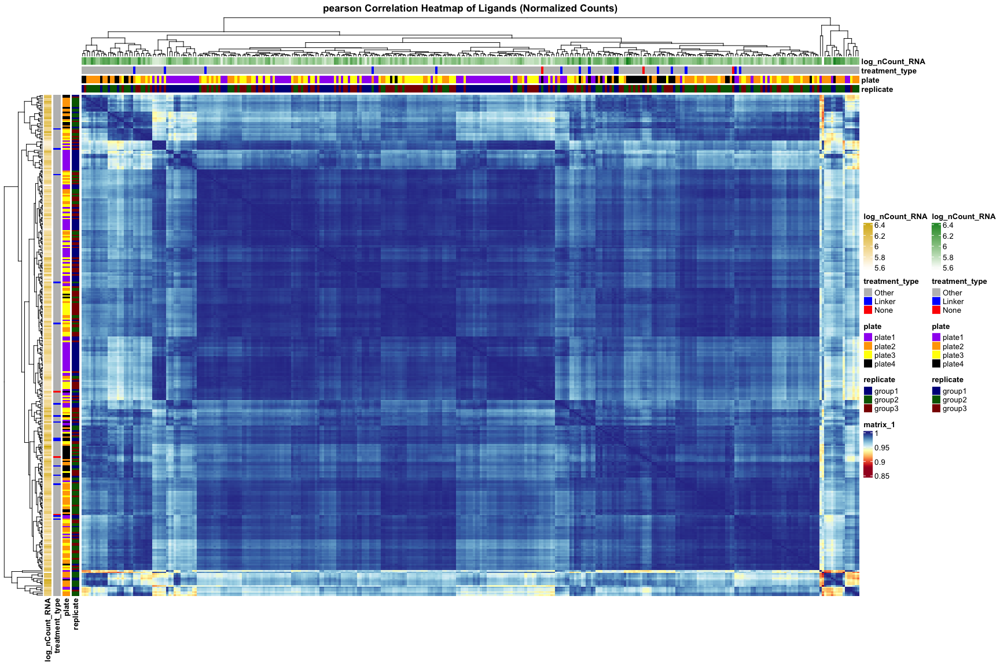
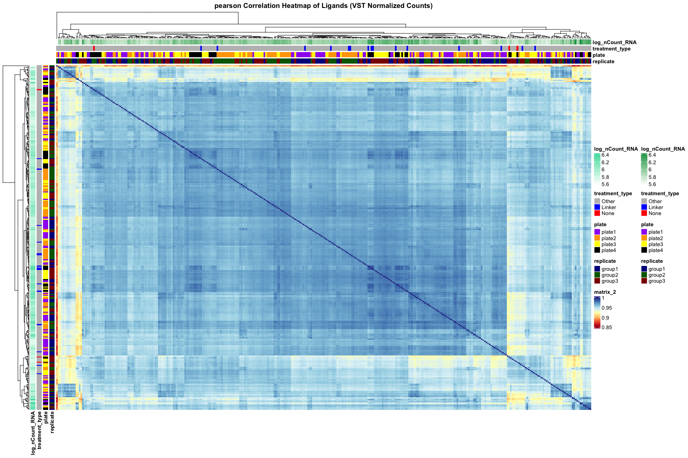
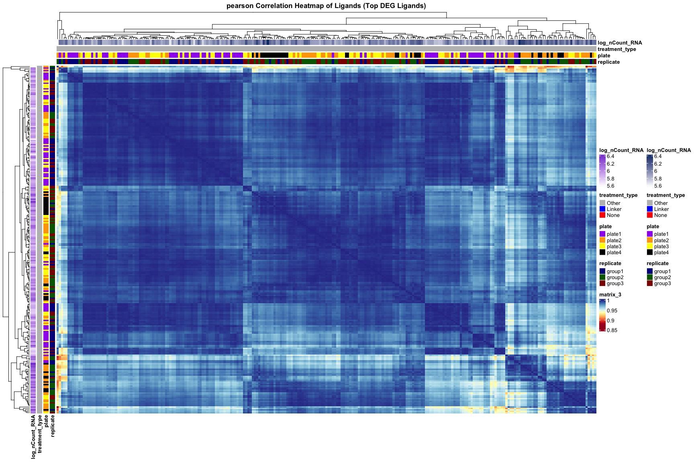

Correlation Heatmaps
================
Ian Zumpano
2024-11-22

- [<u>Import Data</u>](#import-data)
- [<u>Normalization and Diagnostic
  Plots</u>](#normalization-and-diagnostic-plots)
- [Load DEG Analysis](#load-deg-analysis)
- [Plot Correlation Heatmaps](#plot-correlation-heatmaps)
- [Prepare annotation and metadata](#prepare-annotation-and-metadata)

``` r
library(tidyverse)
```

    ## ── Attaching core tidyverse packages ──────────────────────── tidyverse 2.0.0 ──
    ## ✔ dplyr     1.1.4     ✔ readr     2.1.5
    ## ✔ forcats   1.0.0     ✔ stringr   1.5.1
    ## ✔ ggplot2   3.5.1     ✔ tibble    3.2.1
    ## ✔ lubridate 1.9.3     ✔ tidyr     1.3.1
    ## ✔ purrr     1.0.2     
    ## ── Conflicts ────────────────────────────────────────── tidyverse_conflicts() ──
    ## ✖ dplyr::filter() masks stats::filter()
    ## ✖ dplyr::lag()    masks stats::lag()
    ## ℹ Use the conflicted package (<http://conflicted.r-lib.org/>) to force all conflicts to become errors

``` r
library(ggplot2)
library(cowplot)
```

    ## 
    ## Attaching package: 'cowplot'
    ## 
    ## The following object is masked from 'package:lubridate':
    ## 
    ##     stamp

``` r
library(patchwork)
```

    ## 
    ## Attaching package: 'patchwork'
    ## 
    ## The following object is masked from 'package:cowplot':
    ## 
    ##     align_plots

``` r
library(DESeq2)
```

    ## Loading required package: S4Vectors
    ## Loading required package: stats4
    ## Loading required package: BiocGenerics
    ## 
    ## Attaching package: 'BiocGenerics'
    ## 
    ## The following objects are masked from 'package:lubridate':
    ## 
    ##     intersect, setdiff, union
    ## 
    ## The following objects are masked from 'package:dplyr':
    ## 
    ##     combine, intersect, setdiff, union
    ## 
    ## The following objects are masked from 'package:stats':
    ## 
    ##     IQR, mad, sd, var, xtabs
    ## 
    ## The following objects are masked from 'package:base':
    ## 
    ##     anyDuplicated, aperm, append, as.data.frame, basename, cbind,
    ##     colnames, dirname, do.call, duplicated, eval, evalq, Filter, Find,
    ##     get, grep, grepl, intersect, is.unsorted, lapply, Map, mapply,
    ##     match, mget, order, paste, pmax, pmax.int, pmin, pmin.int,
    ##     Position, rank, rbind, Reduce, rownames, sapply, setdiff, table,
    ##     tapply, union, unique, unsplit, which.max, which.min
    ## 
    ## 
    ## Attaching package: 'S4Vectors'
    ## 
    ## The following objects are masked from 'package:lubridate':
    ## 
    ##     second, second<-
    ## 
    ## The following objects are masked from 'package:dplyr':
    ## 
    ##     first, rename
    ## 
    ## The following object is masked from 'package:tidyr':
    ## 
    ##     expand
    ## 
    ## The following object is masked from 'package:utils':
    ## 
    ##     findMatches
    ## 
    ## The following objects are masked from 'package:base':
    ## 
    ##     expand.grid, I, unname
    ## 
    ## Loading required package: IRanges
    ## 
    ## Attaching package: 'IRanges'
    ## 
    ## The following object is masked from 'package:lubridate':
    ## 
    ##     %within%
    ## 
    ## The following objects are masked from 'package:dplyr':
    ## 
    ##     collapse, desc, slice
    ## 
    ## The following object is masked from 'package:purrr':
    ## 
    ##     reduce
    ## 
    ## Loading required package: GenomicRanges
    ## Loading required package: GenomeInfoDb
    ## Loading required package: SummarizedExperiment
    ## Loading required package: MatrixGenerics
    ## Loading required package: matrixStats
    ## 
    ## Attaching package: 'matrixStats'
    ## 
    ## The following object is masked from 'package:dplyr':
    ## 
    ##     count
    ## 
    ## 
    ## Attaching package: 'MatrixGenerics'
    ## 
    ## The following objects are masked from 'package:matrixStats':
    ## 
    ##     colAlls, colAnyNAs, colAnys, colAvgsPerRowSet, colCollapse,
    ##     colCounts, colCummaxs, colCummins, colCumprods, colCumsums,
    ##     colDiffs, colIQRDiffs, colIQRs, colLogSumExps, colMadDiffs,
    ##     colMads, colMaxs, colMeans2, colMedians, colMins, colOrderStats,
    ##     colProds, colQuantiles, colRanges, colRanks, colSdDiffs, colSds,
    ##     colSums2, colTabulates, colVarDiffs, colVars, colWeightedMads,
    ##     colWeightedMeans, colWeightedMedians, colWeightedSds,
    ##     colWeightedVars, rowAlls, rowAnyNAs, rowAnys, rowAvgsPerColSet,
    ##     rowCollapse, rowCounts, rowCummaxs, rowCummins, rowCumprods,
    ##     rowCumsums, rowDiffs, rowIQRDiffs, rowIQRs, rowLogSumExps,
    ##     rowMadDiffs, rowMads, rowMaxs, rowMeans2, rowMedians, rowMins,
    ##     rowOrderStats, rowProds, rowQuantiles, rowRanges, rowRanks,
    ##     rowSdDiffs, rowSds, rowSums2, rowTabulates, rowVarDiffs, rowVars,
    ##     rowWeightedMads, rowWeightedMeans, rowWeightedMedians,
    ##     rowWeightedSds, rowWeightedVars
    ## 
    ## Loading required package: Biobase
    ## Welcome to Bioconductor
    ## 
    ##     Vignettes contain introductory material; view with
    ##     'browseVignettes()'. To cite Bioconductor, see
    ##     'citation("Biobase")', and for packages 'citation("pkgname")'.
    ## 
    ## 
    ## Attaching package: 'Biobase'
    ## 
    ## The following object is masked from 'package:MatrixGenerics':
    ## 
    ##     rowMedians
    ## 
    ## The following objects are masked from 'package:matrixStats':
    ## 
    ##     anyMissing, rowMedians

``` r
library(ComplexHeatmap)
```

    ## Loading required package: grid
    ## ========================================
    ## ComplexHeatmap version 2.20.0
    ## Bioconductor page: http://bioconductor.org/packages/ComplexHeatmap/
    ## Github page: https://github.com/jokergoo/ComplexHeatmap
    ## Documentation: http://jokergoo.github.io/ComplexHeatmap-reference
    ## 
    ## If you use it in published research, please cite either one:
    ## - Gu, Z. Complex Heatmap Visualization. iMeta 2022.
    ## - Gu, Z. Complex heatmaps reveal patterns and correlations in multidimensional 
    ##     genomic data. Bioinformatics 2016.
    ## 
    ## 
    ## The new InteractiveComplexHeatmap package can directly export static 
    ## complex heatmaps into an interactive Shiny app with zero effort. Have a try!
    ## 
    ## This message can be suppressed by:
    ##   suppressPackageStartupMessages(library(ComplexHeatmap))
    ## ========================================

``` r
library(IHW)
```

    ## 
    ## Attaching package: 'IHW'
    ## 
    ## The following object is masked from 'package:ggplot2':
    ## 
    ##     alpha

``` r
library(RColorBrewer)
knitr::opts_chunk$set(echo = TRUE)
```

``` r
source("../functions/plotting_fxns.R")
theme_set(theme_Publication())
```

    ## 
    ## Attaching package: 'ggthemes'

    ## The following object is masked from 'package:cowplot':
    ## 
    ##     theme_map

### <u>Import Data</u>

``` r
data <- read.csv("../processing_outs/count_matrix_umiDeDup_SIG06.csv", row.names = "X")

metadata <- read_csv("../processing_outs/processed_metadata_SIG06.csv")
```

    ## Rows: 330 Columns: 7
    ## ── Column specification ────────────────────────────────────────────────────────
    ## Delimiter: ","
    ## chr (5): sample_ID, treatment, replicate, plate, well
    ## dbl (2): nFeature_RNA, nCount_RNA
    ## 
    ## ℹ Use `spec()` to retrieve the full column specification for this data.
    ## ℹ Specify the column types or set `show_col_types = FALSE` to quiet this message.

``` r
# import feature names
featureNames <- read_csv("../processing_outs/featureNames_SIG06.csv")
```

    ## Rows: 57186 Columns: 3
    ## ── Column specification ────────────────────────────────────────────────────────
    ## Delimiter: ","
    ## chr (3): ensembl_ID, gene, category
    ## 
    ## ℹ Use `spec()` to retrieve the full column specification for this data.
    ## ℹ Specify the column types or set `show_col_types = FALSE` to quiet this message.

``` r
featureNames <- select(featureNames, -category)
```

### <u>Normalization and Diagnostic Plots</u>

``` r
# prepare metadata for DESeq
metaDF <- as.data.frame(metadata[,-1])
rownames(metaDF) <- metadata$sample_ID

# match matrix and metadata
data <- data[,rownames(metaDF)]
```

#### Read normalized counts

``` r
normCounts <- read.csv("../analysis_outs/counts_norm_DEseq2.csv")
```

#### Create DESeq object

``` r
# import dds object
dds <- readRDS("/Users/izumpano/Desktop/Eric Analyses/SIG06/analysis_outs/dds_object_SIG06.rds")
```

#### Create Treatment Groups

``` r
# select viral treatments groups
viralGroups <- dds$treatment %>% unique()
viralGroups <- viralGroups[grep("recomb|none|linker", viralGroups, invert = T)]
viralGroups
```

    ##  [1] CCL25    IL2      TGFB3    BMP7     MIF      CCL3     IL1F9    IL11    
    ##  [9] IFNB1    LEP      CCL27    BMP4     IL18     IL17F    IL13     TNFSF15 
    ## [17] IL17A    CCL8     IL6      CCL4     IL9      IL27     WNT5A    IL1A    
    ## [25] IL4      CX3CL1   CTF1     GDF7     IL1F8    MSTN     IL1F6    PF4     
    ## [33] TNFSF8   WNT1     TNF      CXCL16   IL1F5    TNFSF10  IL16     IFNK    
    ## [41] CCL9     IL1F10   TGFB1    LIF      TGFB2    CCL21A   GDF11    CXCL9   
    ## [49] CCL12    CXCL12   CCL24    IL21     CCL28    IL33     CCL19    CCL11   
    ## [57] WNT3A    IL17B    INHBA    GDF2     IL23     TSLP     TNFSF9   IL25    
    ## [65] BMP10    TNFSF4   IFNA     CCL22    CCL2     GDF15    CXCL13   CCL26   
    ## [73] IFNG     IL1B     IFNE     CCL7     ADIPOQ   GDF10    IL15     WNT7A   
    ## [81] CCL5     LTA      OSM      CCL17    INHBB    CCL20    IL35     CCL1    
    ## [89] CXCL10   CXCL11   IL12     IL7      IL17C    IL10     TNFSF13B TNFSF13 
    ## [97] TNFSF14  TNFSF12  TNFSF18 
    ## 106 Levels: ADIPOQ BMP10 BMP4 BMP7 CCL1 CCL11 CCL12 CCL17 CCL19 CCL2 ... WNT7A

``` r
# select recombinant treatments groups
recombGroups <- dds$treatment %>% unique()
recombGroups <- grep("recomb", recombGroups, value = T)
recombGroups
```

    ## [1] "IL6recomb"  "IFNGrecomb" "IL12recomb" "IL2recomb"  "IL4recomb"

``` r
# select linkers
linkerGroups <- dds$treatment %>% unique()
linkerGroups <- grep("linker", linkerGroups, value = T)
linkerGroups
```

    ## [1] "linker"

### Load DEG Analysis

``` r
res_viral <- read.csv("../analysis_outs/res_viral.csv")
```

### Plot Correlation Heatmaps

### Prepare annotation and metadata

``` r
metadata$treatment_type <- ifelse(metadata$treatment == "linker", "Linker",
                                    ifelse(metadata$treatment == "none", "None", "Other")) %>%  as_factor()

metadata$log_nCount_RNA <- log10(metadata$nCount_RNA)

annotation <- metadata %>% 
    select(sample_ID, replicate, plate, treatment_type, log_nCount_RNA) %>% data.frame(row.names = "sample_ID")
  
normCounts_rows <-normCounts %>% column_to_rownames("ensembl_ID") %>% select(-gene)
```

#### Create Helper Function to Plot Heatmaps

``` r
# Define annotation colors
annotation_colors <- list(
  replicate = c(group1 = "darkblue", group2 = "darkgreen", group3 = "darkred"),
  plate = c(plate1 = "purple", plate2 = "orange", plate3 = "yellow", plate4 = "black"),
  treatment_type = c(Linker = "blue", None = "red", Other = "gray")
)

plot_ligand_correlation_heatmap <- function(norm_counts, metadata, annotation, method = "pearson", color_palette = "RdYlBu", title = "") {
  # Compute correlation matrix
  correlation_matrix <- cor(norm_counts, method = method)
  
  # Plot heatmap
  pheatmap(
    correlation_matrix,
    annotation_col = annotation,
    annotation_row = annotation,
    annotation_colors = annotation_colors,
    show_rownames = FALSE,
    show_colnames = FALSE,
    color = colorRampPalette(brewer.pal(11, color_palette))(100),
    cluster_rows = TRUE,
    cluster_cols = TRUE,
    legend = TRUE,
    main = paste(method, "Correlation Heatmap of Ligands", title)
  )
}
```

#### Heatmap for all ligands using normalized counts

``` r
plot_ligand_correlation_heatmap(normCounts_rows, metadata, annotation = annotation,  title = "(Normalized Counts)")
```

<!-- -->

#### Heatmap for all ligands using vst normalized counts

``` r
dds_norm <- vst(dds)
normCounts_vst <- assay(dds_norm)

plot_ligand_correlation_heatmap(normCounts_vst, metadata, annotation = annotation, title = "(VST Normalized Counts)")
```

<!-- -->

#### Heatmap of only ligands with DEGs

``` r
library(stringi)

# Create vector of ligands corresponding to DEGs
top_ligands <- res_viral %>% filter(padj < 0.01) %>% pull(treatment) %>% unique()

# filter for columns within normCounts that contain a ligand in top_ligands
pattern <- paste(top_ligands, collapse = "|")
cols  <- stri_detect_regex(names(normCounts_rows), pattern)
normCounts_DEG <- normCounts_rows[, cols]
dim(normCounts_DEG)
```

    ## [1] 15024   249

``` r
annotation_DEG <- annotation[rownames(annotation) %in% colnames(normCounts_DEG), , drop = FALSE]

plot_ligand_correlation_heatmap(normCounts_DEG, metadata, annotation = annotation_DEG, title = "(Top DEG Ligands)")
```

<!-- -->
