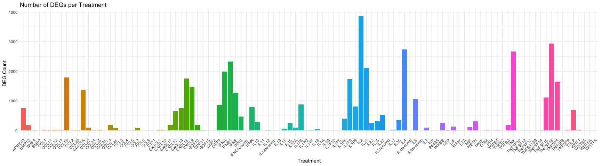

DEG Analysis
================
Ian Zumpano
2024-11-21

- [<u>Import Data</u>](#import-data)
- [<u>Normalization and Diagnostic
  Plots</u>](#normalization-and-diagnostic-plots)
- [<u>DEG Analysis</u>](#deg-analysis)
- [Run DEG Analysis](#run-deg-analysis)
- [Count and Visualize DEGs per
  Treatment](#count-and-visualize-degs-per-treatment)

``` r
library(tidyverse)
```

    ## ── Attaching core tidyverse packages ──────────────────────── tidyverse 2.0.0 ──
    ## ✔ dplyr     1.1.4     ✔ readr     2.1.5
    ## ✔ forcats   1.0.0     ✔ stringr   1.5.1
    ## ✔ ggplot2   3.5.1     ✔ tibble    3.2.1
    ## ✔ lubridate 1.9.3     ✔ tidyr     1.3.1
    ## ✔ purrr     1.0.2     
    ## ── Conflicts ────────────────────────────────────────── tidyverse_conflicts() ──
    ## ✖ dplyr::filter() masks stats::filter()
    ## ✖ dplyr::lag()    masks stats::lag()
    ## ℹ Use the conflicted package (<http://conflicted.r-lib.org/>) to force all conflicts to become errors

``` r
library(ggplot2)
library(cowplot)
```

    ## 
    ## Attaching package: 'cowplot'
    ## 
    ## The following object is masked from 'package:lubridate':
    ## 
    ##     stamp

``` r
library(patchwork)
```

    ## 
    ## Attaching package: 'patchwork'
    ## 
    ## The following object is masked from 'package:cowplot':
    ## 
    ##     align_plots

``` r
library(DESeq2)
```

    ## Loading required package: S4Vectors
    ## Loading required package: stats4
    ## Loading required package: BiocGenerics
    ## 
    ## Attaching package: 'BiocGenerics'
    ## 
    ## The following objects are masked from 'package:lubridate':
    ## 
    ##     intersect, setdiff, union
    ## 
    ## The following objects are masked from 'package:dplyr':
    ## 
    ##     combine, intersect, setdiff, union
    ## 
    ## The following objects are masked from 'package:stats':
    ## 
    ##     IQR, mad, sd, var, xtabs
    ## 
    ## The following objects are masked from 'package:base':
    ## 
    ##     anyDuplicated, aperm, append, as.data.frame, basename, cbind,
    ##     colnames, dirname, do.call, duplicated, eval, evalq, Filter, Find,
    ##     get, grep, grepl, intersect, is.unsorted, lapply, Map, mapply,
    ##     match, mget, order, paste, pmax, pmax.int, pmin, pmin.int,
    ##     Position, rank, rbind, Reduce, rownames, sapply, setdiff, table,
    ##     tapply, union, unique, unsplit, which.max, which.min
    ## 
    ## 
    ## Attaching package: 'S4Vectors'
    ## 
    ## The following objects are masked from 'package:lubridate':
    ## 
    ##     second, second<-
    ## 
    ## The following objects are masked from 'package:dplyr':
    ## 
    ##     first, rename
    ## 
    ## The following object is masked from 'package:tidyr':
    ## 
    ##     expand
    ## 
    ## The following object is masked from 'package:utils':
    ## 
    ##     findMatches
    ## 
    ## The following objects are masked from 'package:base':
    ## 
    ##     expand.grid, I, unname
    ## 
    ## Loading required package: IRanges
    ## 
    ## Attaching package: 'IRanges'
    ## 
    ## The following object is masked from 'package:lubridate':
    ## 
    ##     %within%
    ## 
    ## The following objects are masked from 'package:dplyr':
    ## 
    ##     collapse, desc, slice
    ## 
    ## The following object is masked from 'package:purrr':
    ## 
    ##     reduce
    ## 
    ## Loading required package: GenomicRanges
    ## Loading required package: GenomeInfoDb
    ## Loading required package: SummarizedExperiment
    ## Loading required package: MatrixGenerics
    ## Loading required package: matrixStats
    ## 
    ## Attaching package: 'matrixStats'
    ## 
    ## The following object is masked from 'package:dplyr':
    ## 
    ##     count
    ## 
    ## 
    ## Attaching package: 'MatrixGenerics'
    ## 
    ## The following objects are masked from 'package:matrixStats':
    ## 
    ##     colAlls, colAnyNAs, colAnys, colAvgsPerRowSet, colCollapse,
    ##     colCounts, colCummaxs, colCummins, colCumprods, colCumsums,
    ##     colDiffs, colIQRDiffs, colIQRs, colLogSumExps, colMadDiffs,
    ##     colMads, colMaxs, colMeans2, colMedians, colMins, colOrderStats,
    ##     colProds, colQuantiles, colRanges, colRanks, colSdDiffs, colSds,
    ##     colSums2, colTabulates, colVarDiffs, colVars, colWeightedMads,
    ##     colWeightedMeans, colWeightedMedians, colWeightedSds,
    ##     colWeightedVars, rowAlls, rowAnyNAs, rowAnys, rowAvgsPerColSet,
    ##     rowCollapse, rowCounts, rowCummaxs, rowCummins, rowCumprods,
    ##     rowCumsums, rowDiffs, rowIQRDiffs, rowIQRs, rowLogSumExps,
    ##     rowMadDiffs, rowMads, rowMaxs, rowMeans2, rowMedians, rowMins,
    ##     rowOrderStats, rowProds, rowQuantiles, rowRanges, rowRanks,
    ##     rowSdDiffs, rowSds, rowSums2, rowTabulates, rowVarDiffs, rowVars,
    ##     rowWeightedMads, rowWeightedMeans, rowWeightedMedians,
    ##     rowWeightedSds, rowWeightedVars
    ## 
    ## Loading required package: Biobase
    ## Welcome to Bioconductor
    ## 
    ##     Vignettes contain introductory material; view with
    ##     'browseVignettes()'. To cite Bioconductor, see
    ##     'citation("Biobase")', and for packages 'citation("pkgname")'.
    ## 
    ## 
    ## Attaching package: 'Biobase'
    ## 
    ## The following object is masked from 'package:MatrixGenerics':
    ## 
    ##     rowMedians
    ## 
    ## The following objects are masked from 'package:matrixStats':
    ## 
    ##     anyMissing, rowMedians

``` r
library(ComplexHeatmap)
```

    ## Loading required package: grid
    ## ========================================
    ## ComplexHeatmap version 2.20.0
    ## Bioconductor page: http://bioconductor.org/packages/ComplexHeatmap/
    ## Github page: https://github.com/jokergoo/ComplexHeatmap
    ## Documentation: http://jokergoo.github.io/ComplexHeatmap-reference
    ## 
    ## If you use it in published research, please cite either one:
    ## - Gu, Z. Complex Heatmap Visualization. iMeta 2022.
    ## - Gu, Z. Complex heatmaps reveal patterns and correlations in multidimensional 
    ##     genomic data. Bioinformatics 2016.
    ## 
    ## 
    ## The new InteractiveComplexHeatmap package can directly export static 
    ## complex heatmaps into an interactive Shiny app with zero effort. Have a try!
    ## 
    ## This message can be suppressed by:
    ##   suppressPackageStartupMessages(library(ComplexHeatmap))
    ## ========================================

``` r
library(IHW)
```

    ## 
    ## Attaching package: 'IHW'
    ## 
    ## The following object is masked from 'package:ggplot2':
    ## 
    ##     alpha

``` r
knitr::opts_chunk$set(echo = TRUE)
```

``` r
source("../functions/plotting_fxns.R")
theme_set(theme_Publication())
```

    ## 
    ## Attaching package: 'ggthemes'

    ## The following object is masked from 'package:cowplot':
    ## 
    ##     theme_map

### <u>Import Data</u>

``` r
data <- read.csv("../processing_outs/count_matrix_umiDeDup_SIG06.csv", row.names = "X")

metadata <- read_csv("../processing_outs/processed_metadata_SIG06.csv")
```

    ## Rows: 330 Columns: 7
    ## ── Column specification ────────────────────────────────────────────────────────
    ## Delimiter: ","
    ## chr (5): sample_ID, treatment, replicate, plate, well
    ## dbl (2): nFeature_RNA, nCount_RNA
    ## 
    ## ℹ Use `spec()` to retrieve the full column specification for this data.
    ## ℹ Specify the column types or set `show_col_types = FALSE` to quiet this message.

``` r
# import feature names
featureNames <- read_csv("../processing_outs/featureNames_SIG06.csv")
```

    ## Rows: 57186 Columns: 3
    ## ── Column specification ────────────────────────────────────────────────────────
    ## Delimiter: ","
    ## chr (3): ensembl_ID, gene, category
    ## 
    ## ℹ Use `spec()` to retrieve the full column specification for this data.
    ## ℹ Specify the column types or set `show_col_types = FALSE` to quiet this message.

``` r
featureNames <- select(featureNames, -category)
```

### <u>Normalization and Diagnostic Plots</u>

``` r
# prepare metadata for DESeq
metaDF <- as.data.frame(metadata[,-1])
rownames(metaDF) <- metadata$sample_ID

# match matrix and metadata
data <- data[,rownames(metaDF)]
```

``` r
# # create DEseq object
# dds <- DESeqDataSetFromMatrix(data,
#                               colData = metaDF,
#                               design = ~ treatment + replicate)
# 
# # prefilter dds
# # remove any gene with fewer than 5 counts in the smallest group size
# smallestGroupSize <- 3
# keep <- rowSums(counts(dds) >= 2) >= smallestGroupSize
# dds <- dds[keep,]
```

#### Read normalized counts

``` r
# dds <- estimateSizeFactors(dds)
```

``` r
# normCounts <- counts(dds, normalized=T) %>%
#   as_tibble(rownames = "ensembl_ID") %>%
#   left_join(featureNames)
# 
# write_csv(normCounts, "../analysis_outs/counts_norm_DEseq2.csv")

normCounts <- read.csv("../analysis_outs/counts_norm_DEseq2.csv")
```

### <u>DEG Analysis</u>

#### Create DESeq object

``` r
# # perform DE analysis
# dds <- DESeq(dds, parallel = TRUE)
```

``` r
# # save dds object
# saveRDS(dds, "analysis_outs/dds_object_SIG07.rds")

# import dds object
dds <- readRDS("/Users/izumpano/Desktop/Eric Analyses/SIG06/analysis_outs/dds_object_SIG06.rds")
```

#### Calculate DEGs

Made a quick helper function to calculate DEGs.

``` r
# library(IHW)
# library(BiocParallel)
# 
# #Configure the amount of cores used (mac/linux specific function)
# # cores <- MulticoreParam(workers = 8) #8 cores
# 
# # import feature names (used in function below)
# featureNames <- read_csv("../processing_outs/featureNames_SIG06.csv")
# featureNames <- select(featureNames, -category)
# 
# # sample input can be single character or vector of characters
# # control input must be single character, defaults to linker
# iterative_DEG <- function(samples, control = "linker"){
#   # empty tibble for full DEG list
#   resAll <- tibble()
#   for(ligand in samples){
#     print(ligand)
#     # perform IHW DEG analysis
#     # don't perform independent filtering because using IHW
#     res <- results(dds, contrast = c("treatment",ligand,control),
#                  independentFiltering=F,
#                  filterFun = ihw,
#                  parallel = T)
#                  #BPPARAM = cores 
#     
#     # perform LFC shrinkage and make tidy
#     # pass res to lfcShrink
#     resTidy <- lfcShrink(dds, type = "ashr", res=res) %>%
#       as_tibble(rownames = "ensembl_ID") %>%
#       left_join(featureNames) %>%
#       mutate(treatment = ligand) %>%
#       arrange(padj)
#     
#     # add to full DEG list
#     resAll <- bind_rows(resAll, resTidy)
#   }
#   return(resAll)
# }
```

``` r
iterative_DEG <- function(samples, control = "linker") {
  # Empty tibble for full DEG list
  resAll <- tibble()
  
  # Iterate through ligands in samples
  for (ligand in samples) {
    
    # Perform IHW DEG analysis
    res <- results(
      dds,
      contrast = c("treatment", ligand, control),
      independentFiltering = FALSE,
      filterFun = ihw,
      parallel = TRUE
    )
    
    # Perform LFC shrinkage
    resTidy <- lfcShrink(dds, type = "ashr", res = res) %>%
      as_tibble(rownames = "ensembl_ID") %>%
      left_join(featureNames, by = "ensembl_ID") %>%
      mutate(treatment = ligand) %>%
      arrange(padj)
    
    # Append results to cumulative tibble
    resAll <- bind_rows(resAll, resTidy)
  }
  
  return(resAll)
}
```

#### Create Treatment Groups

``` r
# select viral treatments groups
viralGroups <- dds$treatment %>% unique()
viralGroups <- viralGroups[grep("recomb|none|linker", viralGroups, invert = T)]
viralGroups
```

    ##  [1] CCL25    IL2      TGFB3    BMP7     MIF      CCL3     IL1F9    IL11    
    ##  [9] IFNB1    LEP      CCL27    BMP4     IL18     IL17F    IL13     TNFSF15 
    ## [17] IL17A    CCL8     IL6      CCL4     IL9      IL27     WNT5A    IL1A    
    ## [25] IL4      CX3CL1   CTF1     GDF7     IL1F8    MSTN     IL1F6    PF4     
    ## [33] TNFSF8   WNT1     TNF      CXCL16   IL1F5    TNFSF10  IL16     IFNK    
    ## [41] CCL9     IL1F10   TGFB1    LIF      TGFB2    CCL21A   GDF11    CXCL9   
    ## [49] CCL12    CXCL12   CCL24    IL21     CCL28    IL33     CCL19    CCL11   
    ## [57] WNT3A    IL17B    INHBA    GDF2     IL23     TSLP     TNFSF9   IL25    
    ## [65] BMP10    TNFSF4   IFNA     CCL22    CCL2     GDF15    CXCL13   CCL26   
    ## [73] IFNG     IL1B     IFNE     CCL7     ADIPOQ   GDF10    IL15     WNT7A   
    ## [81] CCL5     LTA      OSM      CCL17    INHBB    CCL20    IL35     CCL1    
    ## [89] CXCL10   CXCL11   IL12     IL7      IL17C    IL10     TNFSF13B TNFSF13 
    ## [97] TNFSF14  TNFSF12  TNFSF18 
    ## 106 Levels: ADIPOQ BMP10 BMP4 BMP7 CCL1 CCL11 CCL12 CCL17 CCL19 CCL2 ... WNT7A

``` r
# select recombinant treatments groups
recombGroups <- dds$treatment %>% unique()
recombGroups <- grep("recomb", recombGroups, value = T)
recombGroups
```

    ## [1] "IL6recomb"  "IFNGrecomb" "IL12recomb" "IL2recomb"  "IL4recomb"

``` r
# select linkers
linkerGroups <- dds$treatment %>% unique()
linkerGroups <- grep("linker", linkerGroups, value = T)
linkerGroups
```

    ## [1] "linker"

### Run DEG Analysis

``` r
# res_viral <- iterative_DEG(viralGroups)
# write_csv(res_viral, "../analysis_outs/res_viral.csv")
# 
# res_recomb_vs_none <- iterative_DEG(recombGroups, "none")
# write_csv(res_recomb_vs_none, "../analysis_outs/res_recomb_vs_none.csv")
# 
# res_linker_vs_none <- iterative_DEG(linkerGroups, "none")
# write_csv(res_linker_vs_none, "../analysis_outs/res_linker_vs_none.csv")
```

``` r
res_viral <- read.csv("../analysis_outs/res_viral.csv")
```

### Count and Visualize DEGs per Treatment

#### Count DEGs per Treatment

``` r
res_viral <-  read.csv("../analysis_outs/res_viral.csv")

# Define significance threshold
significant_padj_threshold <- 0.1

# Count DEGs for each treatment, including treatments with zero DEGs
deg_count <- res_viral %>%
  filter(padj < significant_padj_threshold) %>%
  group_by(treatment) %>%
  summarize(DEG_count = n(), .groups = "drop") %>%
  complete(treatment = viralGroups, fill = list(DEG_count = 0)) %>%   # Fill missing treatments with 0
  arrange(desc(DEG_count))
  
res_viral_sig <- res_viral %>%
  filter(padj < significant_padj_threshold)

write_csv(res_viral_sig, "../analysis_outs/res_viral_sig.csv")

print(deg_count)
```

    ## # A tibble: 106 × 2
    ##    treatment DEG_count
    ##    <chr>         <int>
    ##  1 IL2            3853
    ##  2 TNFSF18        2932
    ##  3 IL4            2735
    ##  4 TNF            2666
    ##  5 IFNB1          2332
    ##  6 IL21           2101
    ##  7 IFNA           1986
    ##  8 CCL19          1789
    ##  9 CXCL16         1752
    ## 10 IL1F8          1734
    ## # ℹ 96 more rows

#### Barplot of DEGs per Treatment

``` r
library(ggplot2)

ggplot(deg_count, aes(x = treatment, y = DEG_count, fill = treatment)) +
  geom_bar(stat = "identity", show.legend = FALSE) +
  labs(title = "Number of DEGs per Treatment", x = "Treatment", y = "DEG Count") +
  theme_minimal() +
  theme(axis.text.x = element_text(angle = 45, hjust = 1))
```

<!-- -->
