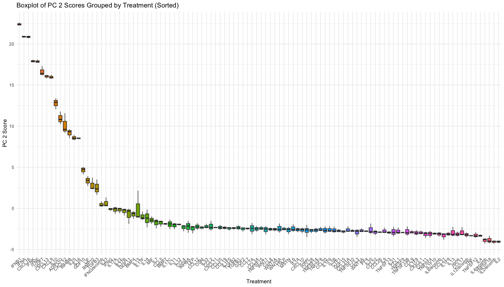
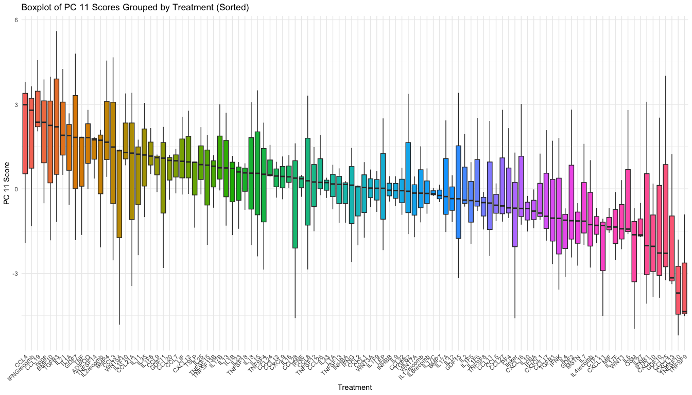
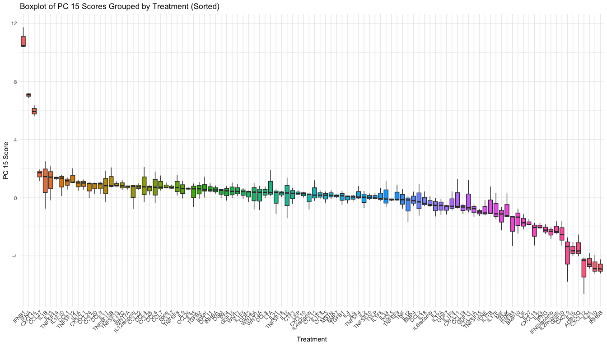

Factor Analysis
================
Ian Zumpano
2024-12-06

- [<u>Import Data</u>](#import-data)
- [<u>Normalization and Diagnostic
  Plots</u>](#normalization-and-diagnostic-plots)
- [Filter only highly variable
  genes](#filter-only-highly-variable-genes)
- [PCA](#pca)
- [Gene set enrichment analysis](#gene-set-enrichment-analysis)
- [Sparce PCA](#sparce-pca)
- [Fit LM for each PC](#fit-lm-for-each-pc)
- [for each pc, make boxplot of pc
  component](#for-each-pc-make-boxplot-of-pc-component)
- [try with different numbers of genes per
  component](#try-with-different-numbers-of-genes-per-component)
  - [Extract PC loadings and save to
    csv](#extract-pc-loadings-and-save-to-csv)

``` r
library(tidyverse)
```

    ## ── Attaching core tidyverse packages ──────────────────────── tidyverse 2.0.0 ──
    ## ✔ dplyr     1.1.4     ✔ readr     2.1.5
    ## ✔ forcats   1.0.0     ✔ stringr   1.5.1
    ## ✔ ggplot2   3.5.1     ✔ tibble    3.2.1
    ## ✔ lubridate 1.9.3     ✔ tidyr     1.3.1
    ## ✔ purrr     1.0.2     
    ## ── Conflicts ────────────────────────────────────────── tidyverse_conflicts() ──
    ## ✖ dplyr::filter() masks stats::filter()
    ## ✖ dplyr::lag()    masks stats::lag()
    ## ℹ Use the conflicted package (<http://conflicted.r-lib.org/>) to force all conflicts to become errors

``` r
library(ggplot2)
library(cowplot)
```

    ## 
    ## Attaching package: 'cowplot'
    ## 
    ## The following object is masked from 'package:lubridate':
    ## 
    ##     stamp

``` r
library(patchwork)
```

    ## 
    ## Attaching package: 'patchwork'
    ## 
    ## The following object is masked from 'package:cowplot':
    ## 
    ##     align_plots

``` r
library(DESeq2)
```

    ## Loading required package: S4Vectors
    ## Loading required package: stats4
    ## Loading required package: BiocGenerics
    ## 
    ## Attaching package: 'BiocGenerics'
    ## 
    ## The following objects are masked from 'package:lubridate':
    ## 
    ##     intersect, setdiff, union
    ## 
    ## The following objects are masked from 'package:dplyr':
    ## 
    ##     combine, intersect, setdiff, union
    ## 
    ## The following objects are masked from 'package:stats':
    ## 
    ##     IQR, mad, sd, var, xtabs
    ## 
    ## The following objects are masked from 'package:base':
    ## 
    ##     anyDuplicated, aperm, append, as.data.frame, basename, cbind,
    ##     colnames, dirname, do.call, duplicated, eval, evalq, Filter, Find,
    ##     get, grep, grepl, intersect, is.unsorted, lapply, Map, mapply,
    ##     match, mget, order, paste, pmax, pmax.int, pmin, pmin.int,
    ##     Position, rank, rbind, Reduce, rownames, sapply, setdiff, table,
    ##     tapply, union, unique, unsplit, which.max, which.min
    ## 
    ## 
    ## Attaching package: 'S4Vectors'
    ## 
    ## The following objects are masked from 'package:lubridate':
    ## 
    ##     second, second<-
    ## 
    ## The following objects are masked from 'package:dplyr':
    ## 
    ##     first, rename
    ## 
    ## The following object is masked from 'package:tidyr':
    ## 
    ##     expand
    ## 
    ## The following object is masked from 'package:utils':
    ## 
    ##     findMatches
    ## 
    ## The following objects are masked from 'package:base':
    ## 
    ##     expand.grid, I, unname
    ## 
    ## Loading required package: IRanges
    ## 
    ## Attaching package: 'IRanges'
    ## 
    ## The following object is masked from 'package:lubridate':
    ## 
    ##     %within%
    ## 
    ## The following objects are masked from 'package:dplyr':
    ## 
    ##     collapse, desc, slice
    ## 
    ## The following object is masked from 'package:purrr':
    ## 
    ##     reduce
    ## 
    ## Loading required package: GenomicRanges
    ## Loading required package: GenomeInfoDb
    ## Loading required package: SummarizedExperiment
    ## Loading required package: MatrixGenerics
    ## Loading required package: matrixStats
    ## 
    ## Attaching package: 'matrixStats'
    ## 
    ## The following object is masked from 'package:dplyr':
    ## 
    ##     count
    ## 
    ## 
    ## Attaching package: 'MatrixGenerics'
    ## 
    ## The following objects are masked from 'package:matrixStats':
    ## 
    ##     colAlls, colAnyNAs, colAnys, colAvgsPerRowSet, colCollapse,
    ##     colCounts, colCummaxs, colCummins, colCumprods, colCumsums,
    ##     colDiffs, colIQRDiffs, colIQRs, colLogSumExps, colMadDiffs,
    ##     colMads, colMaxs, colMeans2, colMedians, colMins, colOrderStats,
    ##     colProds, colQuantiles, colRanges, colRanks, colSdDiffs, colSds,
    ##     colSums2, colTabulates, colVarDiffs, colVars, colWeightedMads,
    ##     colWeightedMeans, colWeightedMedians, colWeightedSds,
    ##     colWeightedVars, rowAlls, rowAnyNAs, rowAnys, rowAvgsPerColSet,
    ##     rowCollapse, rowCounts, rowCummaxs, rowCummins, rowCumprods,
    ##     rowCumsums, rowDiffs, rowIQRDiffs, rowIQRs, rowLogSumExps,
    ##     rowMadDiffs, rowMads, rowMaxs, rowMeans2, rowMedians, rowMins,
    ##     rowOrderStats, rowProds, rowQuantiles, rowRanges, rowRanks,
    ##     rowSdDiffs, rowSds, rowSums2, rowTabulates, rowVarDiffs, rowVars,
    ##     rowWeightedMads, rowWeightedMeans, rowWeightedMedians,
    ##     rowWeightedSds, rowWeightedVars
    ## 
    ## Loading required package: Biobase
    ## Welcome to Bioconductor
    ## 
    ##     Vignettes contain introductory material; view with
    ##     'browseVignettes()'. To cite Bioconductor, see
    ##     'citation("Biobase")', and for packages 'citation("pkgname")'.
    ## 
    ## 
    ## Attaching package: 'Biobase'
    ## 
    ## The following object is masked from 'package:MatrixGenerics':
    ## 
    ##     rowMedians
    ## 
    ## The following objects are masked from 'package:matrixStats':
    ## 
    ##     anyMissing, rowMedians

``` r
library(ComplexHeatmap)
```

    ## Loading required package: grid
    ## ========================================
    ## ComplexHeatmap version 2.20.0
    ## Bioconductor page: http://bioconductor.org/packages/ComplexHeatmap/
    ## Github page: https://github.com/jokergoo/ComplexHeatmap
    ## Documentation: http://jokergoo.github.io/ComplexHeatmap-reference
    ## 
    ## If you use it in published research, please cite either one:
    ## - Gu, Z. Complex Heatmap Visualization. iMeta 2022.
    ## - Gu, Z. Complex heatmaps reveal patterns and correlations in multidimensional 
    ##     genomic data. Bioinformatics 2016.
    ## 
    ## 
    ## The new InteractiveComplexHeatmap package can directly export static 
    ## complex heatmaps into an interactive Shiny app with zero effort. Have a try!
    ## 
    ## This message can be suppressed by:
    ##   suppressPackageStartupMessages(library(ComplexHeatmap))
    ## ========================================

``` r
library(IHW)
```

    ## 
    ## Attaching package: 'IHW'
    ## 
    ## The following object is masked from 'package:ggplot2':
    ## 
    ##     alpha

``` r
library(RColorBrewer)
library(FactoMineR)   # For PCA and factor analysis
library(factoextra)   # For PCA visualization
```

    ## Welcome! Want to learn more? See two factoextra-related books at https://goo.gl/ve3WBa

``` r
library(psych)        # For factor analysis
```

    ## 
    ## Attaching package: 'psych'
    ## 
    ## The following object is masked from 'package:IHW':
    ## 
    ##     alpha
    ## 
    ## The following object is masked from 'package:SummarizedExperiment':
    ## 
    ##     distance
    ## 
    ## The following object is masked from 'package:GenomicRanges':
    ## 
    ##     distance
    ## 
    ## The following objects are masked from 'package:IRanges':
    ## 
    ##     distance, reflect
    ## 
    ## The following objects are masked from 'package:ggplot2':
    ## 
    ##     %+%, alpha

``` r
knitr::opts_chunk$set(echo = TRUE)
```

``` r
source("../functions/plotting_fxns.R")
theme_set(theme_Publication())
```

    ## 
    ## Attaching package: 'ggthemes'

    ## The following object is masked from 'package:cowplot':
    ## 
    ##     theme_map

### <u>Import Data</u>

``` r
data <- read.csv("../processing_outs/count_matrix_umiDeDup_SIG06.csv", row.names = "X")

metadata <- read_csv("../processing_outs/processed_metadata_SIG06.csv")
```

    ## Rows: 330 Columns: 7
    ## ── Column specification ────────────────────────────────────────────────────────
    ## Delimiter: ","
    ## chr (5): sample_ID, treatment, replicate, plate, well
    ## dbl (2): nFeature_RNA, nCount_RNA
    ## 
    ## ℹ Use `spec()` to retrieve the full column specification for this data.
    ## ℹ Specify the column types or set `show_col_types = FALSE` to quiet this message.

``` r
# import feature names
featureNames <- read_csv("../processing_outs/featureNames_SIG06.csv")
```

    ## Rows: 57186 Columns: 3
    ## ── Column specification ────────────────────────────────────────────────────────
    ## Delimiter: ","
    ## chr (3): ensembl_ID, gene, category
    ## 
    ## ℹ Use `spec()` to retrieve the full column specification for this data.
    ## ℹ Specify the column types or set `show_col_types = FALSE` to quiet this message.

``` r
featureNames <- select(featureNames, -category)

res_viral <- read.csv("../analysis_outs/res_viral.csv")
```

### <u>Normalization and Diagnostic Plots</u>

``` r
# prepare metadata for DESeq
metaDF <- as.data.frame(metadata[,-1])
rownames(metaDF) <- metadata$sample_ID

# match matrix and metadata
data <- data[,rownames(metaDF)]
```

#### Read normalized counts

``` r
normCounts <- read.csv("../analysis_outs/counts_norm_DEseq2.csv")
```

#### Create DESeq object and VST normalized counts

``` r
# import dds object
dds <- readRDS("/Users/izumpano/Desktop/Eric Analyses/SIG06/analysis_outs/dds_object_SIG06.rds")

vst <- vst(dds)
norm_counts <- assay(vst)
```

### Filter only highly variable genes

``` r
library(matrixStats)
row_variance <- rowVars(norm_counts)
hvgs <- norm_counts[row_variance > quantile(row_variance, 0.75), ]
```

#### Scaled data

``` r
scaled_data <- t(scale(t(hvgs)))
```

### PCA

#### Run & Visualize PCA

``` r
# # PCA
# pca <- prcomp(t(norm_counts)[, 1:8], scale. = TRUE)
# pca_hvg <- prcomp(hvgs[, 1:8], scale. = TRUE)
# 
# 
# # Visualize PCA
# library(ggplot2)
# pca_df <- as.data.frame(pca$x)
# pca_df$treatment <- metadata$treatment
# ggplot(pca_df, aes(x = PC1, y = PC2, color = treatment)) +
#   geom_point(size = 3) +
#   theme_minimal() +
#   labs(title = "PCA on Highly Variable Genes")
# 
# pca_df <- as.data.frame(pca_hvg$x)
# pca_df$treatment <- metadata$treatment
# ggplot(pca_df, aes(x = PC1, y = PC2, color = treatment)) +
#   geom_point(size = 3) +
#   theme_minimal() +
#   labs(title = "PCA on Highly Variable Genes")
```

### Gene set enrichment analysis

#### All genes

``` r
# pc1_loadings <- data.frame(
#   gene = rownames(pca$rotation),
#   value = pca$rotation[, "PC1"]
# ) %>%
#   arrange(desc(abs(value)))
# 
# geneList <- pc1_loadings %>%
#   dplyr::select(gene, value) %>%
#   arrange(desc(value)) %>%  # Sort in decreasing order
#   deframe()  # Convert to named vector
# 
# mapped_genes <- bitr(names(geneList), fromType = "SYMBOL", toType = "ENTREZID", OrgDb = org.Mm.eg.db)
# geneList <- deframe(mapped_genes)
# 
# # GSEA
# library(clusterProfiler)
# library(org.Mm.eg.db) # Mouse annotations
# 
# gsea_results <- clusterProfiler::gseGO(
#   geneList = geneList,
#   OrgDb = org.Mm.eg.db,
#   ont = "BP",
#   keyType = "ENSEMBL",
#   nPerm = 1000,            # Number of permutations
#   minGSSize = 5,          # Minimum size of gene sets
#   maxGSSize = 1000,         # Maximum size of gene sets
#   pvalueCutoff = 0.1,     # Adjusted p-value cutoff
#   verbose = TRUE
# )
# 
# # Visualize GSEA results
# dotplot(gsea_results)
# 
# mapped_genes <- bitr(names(geneList), fromType = "ENSEMBL", toType = "ENTREZID", OrgDb = org.Mm.eg.db)
# head(mapped_genes)
# 
# # Check overlap
# overlap <- sum(mapped_genes$SYMBOL %in% names(geneList))
# print(overlap)  # Number of overlapping genes

# 
# geneList <- geneList[names(geneList) %in% mapped_genes$ENSEMBL]
# names(geneList) <- mapped_genes$SYMBOL[match(names(geneList), mapped_genes$ENSEMBL)]
# 
# overlap <- sum(names(geneList) %in% mapped_genes$SYMBOL)
# print(overlap) 
# 
# mapped_genes <- bitr(
# names(geneList),
# fromType = "ENSEMBL",
# toType = "SYMBOL",
# OrgDb = org.Mm.eg.db
# )
```

``` r
# dge_mapped_df <- data.frame(
#   gene_symbol = mapIds(
#     # Replace with annotation package for the organism relevant to your data
#     org.Mm.eg.db,
#     keys = res_viral$ensembl_ID,
#     # Replace with the type of gene identifiers in your data
#     keytype = "ENSEMBL",
#     # Replace with the type of gene identifiers you would like to map to
#     column = "SYMBOL",
#     # This will keep only the first mapped value for each Ensembl ID
#     multiVals = "first"))
# dge_mapped_d
#   # )  %>%
#   # # If an Ensembl gene identifier doesn't map to a gene symbol, drop that
#   # # from the data frame
#   # dplyr::filter(!is.na(gene_symbol)) %>%
#   # # Make an `Ensembl` column to store the rownames
#   # tibble::rownames_to_column("Ensembl") %>%
#   # # Now let's join the rest of the expression data
#   # dplyr::inner_join(res_viral, by = c("Ensembl" = "Gene")))
```

### Sparce PCA

#### 50 genes per component

``` r
library(mixOmics)
```

    ## Loading required package: MASS

    ## 
    ## Attaching package: 'MASS'

    ## The following object is masked from 'package:patchwork':
    ## 
    ##     area

    ## The following object is masked from 'package:dplyr':
    ## 
    ##     select

    ## Loading required package: lattice

    ## 
    ## Loaded mixOmics 6.28.0
    ## Thank you for using mixOmics!
    ## Tutorials: http://mixomics.org
    ## Bookdown vignette: https://mixomicsteam.github.io/Bookdown
    ## Questions, issues: Follow the prompts at http://mixomics.org/contact-us
    ## Cite us:  citation('mixOmics')

    ## 
    ## Attaching package: 'mixOmics'

    ## The following object is masked from 'package:psych':
    ## 
    ##     pca

    ## The following object is masked from 'package:purrr':
    ## 
    ##     map

``` r
library(GGally)
```

    ## Registered S3 method overwritten by 'GGally':
    ##   method from   
    ##   +.gg   ggplot2

``` r
library(ggrepel)

if (ncol(hvgs) == 330) {
  hvgs <- t(hvgs)
}

#Only want to do PCA on HVGs

# Run sparse PCA
spca_res <- spca(hvgs, ncomp = 16, keepX = c(50, 50, 50, 50, 50, 50, 50, 50, 50, 50, 50, 50, 50, 50, 50, 50))  # Select 50 genes per component


#plotIndiv(spca_res, group = metadata$treatment, legend = TRUE)

spca_scores_30 <- as.data.frame(spca_res$variates$X)   # Samples x Components

# Add metadata to sPCA scores
spca_scores_30$group <- metadata$treatment  # Replace 'treatment' with your grouping column


# Extract variance contributions
variance_explained <- spca_res$prop_expl_var$X * 100 # Convert to percentage

spca_scores_30$label <- ifelse(spca_scores_30$PC2 > 7, metadata$treatment, NA)
spca_scores_30$label2 <- ifelse(spca_scores_30$PC3 > 5, metadata$treatment, NA)
spca_scores_30$label3 <- ifelse(spca_scores_30$PC5 > 5 | spca_scores_30$PC5 < -4, metadata$treatment, NA)
spca_scores_30$label4 <- ifelse(spca_scores_30$PC7 > 5 | spca_scores_30$PC7 < -4, metadata$treatment, NA)
spca_scores_30$label5 <- ifelse(spca_scores_30$PC9 < -4 | spca_scores_30$PC10 < -3 | spca_scores_30$PC10 > 3, metadata$treatment, NA)

spca_scores_30$label7 <- ifelse(spca_scores_30$PC13 < -4 | spca_scores_30$PC13 > 5 | spca_scores_30$PC14 > 5 | spca_scores_30$PC14 < -5, metadata$treatment, NA)
spca_scores_30$label8 <- ifelse(spca_scores_30$PC15 > 4, metadata$treatment, NA)

# Plot PC1 vs PC2
ggplot(spca_scores_30, aes(x = PC1, y = PC2, color = group)) +
  geom_point(size = 3, alpha = 0.7) +
  labs(
    title = "Sparse PCA: PC1 vs PC2",
    x = paste0("PC1 (", round(variance_explained[1], 2), "%)"),
    y = paste0("PC2 (", round(variance_explained[2], 2), "%)")
  ) + geom_text_repel(aes(label = label), show.legend = FALSE, max.overlaps = Inf)
```

    ## Warning: Removed 288 rows containing missing values or values outside the scale range
    ## (`geom_text_repel()`).

<!-- -->

``` r
# Plot PC3 vs PC4
ggplot(spca_scores_30, aes(x = PC3, y = PC4, color = group)) +
  geom_point(size = 3, alpha = 0.7) +
  labs(
    title = "Sparse PCA: PC3 vs PC4",
    x = paste0("PC3 (", round(variance_explained[3], 2), "%)"),
    y = paste0("PC4 (", round(variance_explained[4], 2), "%)")
  ) + geom_text_repel(aes(label = label2), show.legend = FALSE, max.overlaps = Inf) 
```

    ## Warning: Removed 301 rows containing missing values or values outside the scale range
    ## (`geom_text_repel()`).

<!-- -->

``` r
# Plot PC5 vs PC6
ggplot(spca_scores_30, aes(x = PC5, y = PC6, color = group)) +
  geom_point(size = 3, alpha = 0.7) +
  labs(
    title = "Sparse PCA: PC5 vs PC6",
    x = paste0("PC5 (", round(variance_explained[5], 2), "%)"),
    y = paste0("PC6 (", round(variance_explained[6], 2), "%)")
  ) + geom_text_repel(aes(label = label3), show.legend = FALSE, max.overlaps = Inf) 
```

    ## Warning: Removed 295 rows containing missing values or values outside the scale range
    ## (`geom_text_repel()`).

<!-- -->

``` r
# Plot PC7 vs PC8
ggplot(spca_scores_30, aes(x = PC7, y = PC8, color = group)) +
  geom_point(size = 3, alpha = 0.7) +
  labs(
    title = "Sparse PCA: PC7 vs PC8",
    x = paste0("PC7 (", round(variance_explained[7], 2), "%)"),
    y = paste0("PC8 (", round(variance_explained[8], 2), "%)")
  ) + geom_text_repel(aes(label = label4), show.legend = FALSE, max.overlaps = Inf) 
```

    ## Warning: Removed 297 rows containing missing values or values outside the scale range
    ## (`geom_text_repel()`).

<!-- -->

``` r
# Plot PC9 vs PC10
ggplot(spca_scores_30, aes(x = PC9, y = PC10, color = group)) +
  geom_point(size = 3, alpha = 0.7) +
  labs(
    title = "Sparse PCA: PC9 vs PC10",
    x = paste0("PC9 (", round(variance_explained[9], 2), "%)"),
    y = paste0("PC10 (", round(variance_explained[10], 2), "%)")
  ) + geom_text_repel(aes(label = label5), show.legend = FALSE, max.overlaps = Inf)
```

    ## Warning: Removed 295 rows containing missing values or values outside the scale range
    ## (`geom_text_repel()`).

<!-- -->

``` r
# Plot PC11 vs PC12
ggplot(spca_scores_30, aes(x = PC11, y = PC12, color = group)) +
  geom_point(size = 3, alpha = 0.7) +
  labs(
    title = "Sparse PCA: PC11 vs PC12",
    x = paste0("PC11 (", round(variance_explained[11], 2), "%)"),
    y = paste0("PC12 (", round(variance_explained[12], 2), "%)")
  ) #+ geom_text_repel(aes(label = label6), show.legend = FALSE, max.overlaps = Inf) 
```

<!-- -->

``` r
# Plot PC13 vs PC14
ggplot(spca_scores_30, aes(x = PC13, y = PC14, color = group)) +
  geom_point(size = 3, alpha = 0.7) +
  labs(
    title = "Sparse PCA: PC13 vs PC14",
    x = paste0("PC13 (", round(variance_explained[13], 2), "%)"),
    y = paste0("PC14 (", round(variance_explained[14], 2), "%)")
  ) + geom_text_repel(aes(label = label7), show.legend = FALSE, max.overlaps = Inf) 
```

    ## Warning: Removed 306 rows containing missing values or values outside the scale range
    ## (`geom_text_repel()`).

<!-- -->

``` r
# Plot PC15 vs PC16
ggplot(spca_scores_30, aes(x = PC15, y = PC16, color = group)) +
  geom_point(size = 3, alpha = 0.7) +
  labs(
    title = "Sparse PCA: PC13 vs PC14",
    x = paste0("PC15 (", round(variance_explained[15], 2), "%)"),
    y = paste0("PC16 (", round(variance_explained[16], 2), "%)")
  ) + geom_text_repel(aes(label = label8), show.legend = FALSE, max.overlaps = Inf) 
```

    ## Warning: Removed 321 rows containing missing values or values outside the scale range
    ## (`geom_text_repel()`).

<!-- -->

#### 30 genes per component

``` r
if (ncol(hvgs) == 330) {
  hvgs <- t(hvgs)
}

# Run sparse PCA
spca_res_30 <- spca(hvgs, ncomp = 16, keepX = c(30, 30, 30, 30, 30, 30, 30, 30, 30, 30, 30, 30, 30, 30, 30, 30))  # Select 30 genes per component


#plotIndiv(spca_res, group = metadata$treatment, legend = TRUE)

spca_scores_30 <- as.data.frame(spca_res_30$variates$X)   # Samples x Components

# Add metadata to sPCA scores
spca_scores_30$group <- metadata$treatment  # Replace 'treatment' with your grouping column


# Extract variance contributions
variance_explained <- spca_res_30$prop_expl_var$X * 100 # Convert to percentage

spca_scores_30$label <- ifelse(spca_scores_30$PC2 > 5, metadata$treatment, NA)
spca_scores_30$label2 <- ifelse(spca_scores_30$PC3 > 5, metadata$treatment, NA)
spca_scores_30$label3 <- ifelse(spca_scores_30$PC5 > 4 | spca_scores_30$PC5 < -4, metadata$treatment, NA)
spca_scores_30$label4 <- ifelse(spca_scores_30$PC7 > 3 | spca_scores_30$PC7 < -4, metadata$treatment, NA)
spca_scores_30$label5 <- ifelse(spca_scores_30$PC9 < -4 | spca_scores_30$PC10 < -3 | spca_scores_30$PC10 > 3, metadata$treatment, NA)
spca_scores_30$label6 <- ifelse(spca_scores_30$PC12 < -4 | spca_scores_30$PC12 > 5 | spca_scores_30$PC11 < -4, metadata$treatment, NA)
spca_scores_30$label7 <- ifelse(spca_scores_30$PC13 < -4 | spca_scores_30$PC13 > 5 | spca_scores_30$PC14 > 5 | spca_scores_30$PC14 < -5, metadata$treatment, NA)
spca_scores_30$label8 <- ifelse(spca_scores_30$PC15 > 4, metadata$treatment, NA)

# Plot PC1 vs PC2
ggplot(spca_scores_30, aes(x = PC1, y = PC2, color = group)) +
  geom_point(size = 3, alpha = 0.7) +
  labs(
    title = "Sparse PCA: PC1 vs PC2",
    x = paste0("PC1 (", round(variance_explained[1], 2), "%)"),
    y = paste0("PC2 (", round(variance_explained[2], 2), "%)")
  ) + geom_text_repel(aes(label = label), show.legend = FALSE, max.overlaps = Inf)
```

    ## Warning: Removed 288 rows containing missing values or values outside the scale range
    ## (`geom_text_repel()`).

<!-- -->

``` r
# Plot PC3 vs PC4
ggplot(spca_scores_30, aes(x = PC3, y = PC4, color = group)) +
  geom_point(size = 3, alpha = 0.7) +
  labs(
    title = "Sparse PCA: PC3 vs PC4",
    x = paste0("PC3 (", round(variance_explained[3], 2), "%)"),
    y = paste0("PC4 (", round(variance_explained[4], 2), "%)")
  ) + geom_text_repel(aes(label = label2), show.legend = FALSE, max.overlaps = Inf) 
```

    ## Warning: Removed 308 rows containing missing values or values outside the scale range
    ## (`geom_text_repel()`).

<!-- -->

``` r
# Plot PC5 vs PC6
ggplot(spca_scores_30, aes(x = PC5, y = PC6, color = group)) +
  geom_point(size = 3, alpha = 0.7) +
  labs(
    title = "Sparse PCA: PC5 vs PC6",
    x = paste0("PC5 (", round(variance_explained[5], 2), "%)"),
    y = paste0("PC6 (", round(variance_explained[6], 2), "%)")
  ) + geom_text_repel(aes(label = label3), show.legend = FALSE, max.overlaps = Inf) 
```

    ## Warning: Removed 297 rows containing missing values or values outside the scale range
    ## (`geom_text_repel()`).

<!-- -->

``` r
# Plot PC7 vs PC8
ggplot(spca_scores_30, aes(x = PC7, y = PC8, color = group)) +
  geom_point(size = 3, alpha = 0.7) +
  labs(
    title = "Sparse PCA: PC7 vs PC8",
    x = paste0("PC7 (", round(variance_explained[7], 2), "%)"),
    y = paste0("PC8 (", round(variance_explained[8], 2), "%)")
  ) + geom_text_repel(aes(label = label4), show.legend = FALSE, max.overlaps = Inf) 
```

    ## Warning: Removed 279 rows containing missing values or values outside the scale range
    ## (`geom_text_repel()`).

<!-- -->

``` r
# Plot PC9 vs PC10
ggplot(spca_scores_30, aes(x = PC9, y = PC10, color = group)) +
  geom_point(size = 3, alpha = 0.7) +
  labs(
    title = "Sparse PCA: PC9 vs PC10",
    x = paste0("PC9 (", round(variance_explained[9], 2), "%)"),
    y = paste0("PC10 (", round(variance_explained[10], 2), "%)")
  ) + geom_text_repel(aes(label = label5), show.legend = FALSE, max.overlaps = Inf)
```

    ## Warning: Removed 299 rows containing missing values or values outside the scale range
    ## (`geom_text_repel()`).

<!-- -->

``` r
# Plot PC11 vs PC12
ggplot(spca_scores_30, aes(x = PC11, y = PC12, color = group)) +
  geom_point(size = 3, alpha = 0.7) +
  labs(
    title = "Sparse PCA: PC11 vs PC12",
    x = paste0("PC11 (", round(variance_explained[11], 2), "%)"),
    y = paste0("PC12 (", round(variance_explained[12], 2), "%)")
  ) + geom_text_repel(aes(label = label6), show.legend = FALSE, max.overlaps = Inf) 
```

    ## Warning: Removed 304 rows containing missing values or values outside the scale range
    ## (`geom_text_repel()`).

<!-- -->

``` r
# Plot PC13 vs PC14
ggplot(spca_scores_30, aes(x = PC13, y = PC14, color = group)) +
  geom_point(size = 3, alpha = 0.7) +
  labs(
    title = "Sparse PCA: PC13 vs PC14",
    x = paste0("PC13 (", round(variance_explained[13], 2), "%)"),
    y = paste0("PC14 (", round(variance_explained[14], 2), "%)")
  ) + geom_text_repel(aes(label = label7), show.legend = FALSE, max.overlaps = Inf) 
```

    ## Warning: Removed 318 rows containing missing values or values outside the scale range
    ## (`geom_text_repel()`).

<!-- -->

``` r
# Plot PC15 vs PC16
ggplot(spca_scores_30, aes(x = PC15, y = PC16, color = group)) +
  geom_point(size = 3, alpha = 0.7) +
  labs(
    title = "Sparse PCA: PC13 vs PC14",
    x = paste0("PC15 (", round(variance_explained[15], 2), "%)"),
    y = paste0("PC16 (", round(variance_explained[16], 2), "%)")
  ) + geom_text_repel(aes(label = label8), show.legend = FALSE, max.overlaps = Inf) 
```

    ## Warning: Removed 321 rows containing missing values or values outside the scale range
    ## (`geom_text_repel()`).

<!-- -->

#### 10 genes per component

``` r
if (ncol(hvgs) == 310) {
  hvgs <- t(hvgs)
}

# Run sparse PCA
spca_res_10 <- spca(hvgs, ncomp = 16, keepX = c(10, 10, 10, 10, 10, 10, 10, 10, 10, 10, 10, 10, 10, 10, 10, 10))  # Select 10 genes per component


#plotIndiv(spca_res, group = metadata$treatment, legend = TRUE)

spca_scores_10 <- as.data.frame(spca_res_10$variates$X)   # Samples x Components

# Add metadata to sPCA scores
spca_scores_10$group <- metadata$treatment  # Replace 'treatment' with your grouping column


# Extract variance contributions
variance_explained <- spca_res_10$prop_expl_var$X * 100 # Convert to percentage

spca_scores_10$label <- ifelse(spca_scores_10$PC2 > 5, metadata$treatment, NA)
spca_scores_10$label2 <- ifelse(spca_scores_10$PC3 > 5, metadata$treatment, NA)
spca_scores_10$label3 <- ifelse(spca_scores_10$PC5 > 4 | spca_scores_10$PC5 < -4, metadata$treatment, NA)
spca_scores_10$label4 <- ifelse(spca_scores_10$PC7 > 3 | spca_scores_10$PC7 < -4, metadata$treatment, NA)
spca_scores_10$label5 <- ifelse(spca_scores_10$PC9 < -4 | spca_scores_10$PC10 < -3 | spca_scores_10$PC10 > 3, metadata$treatment, NA)
spca_scores_10$label6 <- ifelse(spca_scores_10$PC12 < -4 | spca_scores_10$PC12 > 5 | spca_scores_10$PC11 < -4, metadata$treatment, NA)
spca_scores_10$label7 <- ifelse(spca_scores_10$PC13 < -4 | spca_scores_10$PC13 > 5 | spca_scores_10$PC14 > 5 | spca_scores_10$PC14 < -5, metadata$treatment, NA)
spca_scores_10$label8 <- ifelse(spca_scores_10$PC15 > 4, metadata$treatment, NA)

# Plot PC1 vs PC2
ggplot(spca_scores_10, aes(x = PC1, y = PC2, color = group)) +
  geom_point(size = 3, alpha = 0.7) +
  labs(
    title = "Sparse PCA: PC1 vs PC2",
    x = paste0("PC1 (", round(variance_explained[1], 2), "%)"),
    y = paste0("PC2 (", round(variance_explained[2], 2), "%)")
  ) + geom_text_repel(aes(label = label), show.legend = FALSE, max.overlaps = Inf)
```

    ## Warning: Removed 299 rows containing missing values or values outside the scale range
    ## (`geom_text_repel()`).

<!-- -->

``` r
# Plot PC3 vs PC4
ggplot(spca_scores_10, aes(x = PC3, y = PC4, color = group)) +
  geom_point(size = 3, alpha = 0.7) +
  labs(
    title = "Sparse PCA: PC3 vs PC4",
    x = paste0("PC3 (", round(variance_explained[3], 2), "%)"),
    y = paste0("PC4 (", round(variance_explained[4], 2), "%)")
  ) + geom_text_repel(aes(label = label2), show.legend = FALSE, max.overlaps = Inf) 
```

    ## Warning: Removed 317 rows containing missing values or values outside the scale range
    ## (`geom_text_repel()`).

<!-- -->

``` r
# Plot PC5 vs PC6
ggplot(spca_scores_10, aes(x = PC5, y = PC6, color = group)) +
  geom_point(size = 3, alpha = 0.7) +
  labs(
    title = "Sparse PCA: PC5 vs PC6",
    x = paste0("PC5 (", round(variance_explained[5], 2), "%)"),
    y = paste0("PC6 (", round(variance_explained[6], 2), "%)")
  ) + geom_text_repel(aes(label = label3), show.legend = FALSE, max.overlaps = Inf) 
```

    ## Warning: Removed 310 rows containing missing values or values outside the scale range
    ## (`geom_text_repel()`).

<!-- -->

``` r
# Plot PC7 vs PC8
ggplot(spca_scores_10, aes(x = PC7, y = PC8, color = group)) +
  geom_point(size = 3, alpha = 0.7) +
  labs(
    title = "Sparse PCA: PC7 vs PC8",
    x = paste0("PC7 (", round(variance_explained[7], 2), "%)"),
    y = paste0("PC8 (", round(variance_explained[8], 2), "%)")
  ) + geom_text_repel(aes(label = label4), show.legend = FALSE, max.overlaps = Inf) 
```

    ## Warning: Removed 301 rows containing missing values or values outside the scale range
    ## (`geom_text_repel()`).

<!-- -->

``` r
# Plot PC9 vs PC10
ggplot(spca_scores_10, aes(x = PC9, y = PC10, color = group)) +
  geom_point(size = 3, alpha = 0.7) +
  labs(
    title = "Sparse PCA: PC9 vs PC10",
    x = paste0("PC9 (", round(variance_explained[9], 2), "%)"),
    y = paste0("PC10 (", round(variance_explained[10], 2), "%)")
  ) + geom_text_repel(aes(label = label5), show.legend = FALSE, max.overlaps = Inf)
```

    ## Warning: Removed 304 rows containing missing values or values outside the scale range
    ## (`geom_text_repel()`).

<!-- -->

``` r
# Plot PC11 vs PC12
ggplot(spca_scores_10, aes(x = PC11, y = PC12, color = group)) +
  geom_point(size = 3, alpha = 0.7) +
  labs(
    title = "Sparse PCA: PC11 vs PC12",
    x = paste0("PC11 (", round(variance_explained[11], 2), "%)"),
    y = paste0("PC12 (", round(variance_explained[12], 2), "%)")
  ) + geom_text_repel(aes(label = label6), show.legend = FALSE, max.overlaps = Inf) 
```

    ## Warning: Removed 315 rows containing missing values or values outside the scale range
    ## (`geom_text_repel()`).

<!-- -->

``` r
# Plot PC13 vs PC14
ggplot(spca_scores_10, aes(x = PC13, y = PC14, color = group)) +
  geom_point(size = 3, alpha = 0.7) +
  labs(
    title = "Sparse PCA: PC13 vs PC14",
    x = paste0("PC13 (", round(variance_explained[13], 2), "%)"),
    y = paste0("PC14 (", round(variance_explained[14], 2), "%)")
  ) + geom_text_repel(aes(label = label7), show.legend = FALSE, max.overlaps = Inf) 
```

    ## Warning: Removed 318 rows containing missing values or values outside the scale range
    ## (`geom_text_repel()`).

<!-- -->

``` r
# Plot PC15 vs PC16
ggplot(spca_scores_10, aes(x = PC15, y = PC16, color = group)) +
  geom_point(size = 3, alpha = 0.7) +
  labs(
    title = "Sparse PCA: PC13 vs PC14",
    x = paste0("PC15 (", round(variance_explained[15], 2), "%)"),
    y = paste0("PC16 (", round(variance_explained[16], 2), "%)")
  ) + geom_text_repel(aes(label = label8), show.legend = FALSE, max.overlaps = Inf) 
```

    ## Warning: Removed 330 rows containing missing values or values outside the scale range
    ## (`geom_text_repel()`).

<!-- -->

#### 5 genes per component

``` r
if (ncol(hvgs) == 330) {
  hvgs <- t(hvgs)
}

# Run sparse PCA
spca_res_5 <- spca(hvgs, ncomp = 16, keepX = c(5, 5, 5, 5, 5, 5, 5, 5, 5, 5, 5, 5, 5, 5, 5, 5))  # Select 5 genes per component


#plotIndiv(spca_res, group = metadata$treatment, legend = TRUE)

spca_scores_5 <- as.data.frame(spca_res_5$variates$X)   # Samples x Components

# Add metadata to sPCA scores
spca_scores_5$group <- metadata$treatment  # Replace 'treatment' with your grouping column


# Extract variance contributions
variance_explained <- spca_res_5$prop_expl_var$X * 100 # Convert to percentage

spca_scores_5$label <- ifelse(spca_scores_5$PC2 > 5, metadata$treatment, NA)
spca_scores_5$label2 <- ifelse(spca_scores_5$PC3 > 5, metadata$treatment, NA)
spca_scores_5$label3 <- ifelse(spca_scores_5$PC5 > 4 | spca_scores_5$PC5 < -4, metadata$treatment, NA)
spca_scores_5$label4 <- ifelse(spca_scores_5$PC7 > 3 | spca_scores_5$PC7 < -4, metadata$treatment, NA)
spca_scores_5$label5 <- ifelse(spca_scores_5$PC9 < -4 | spca_scores_5$PC10 < -3 | spca_scores_5$PC10 > 3, metadata$treatment, NA)
spca_scores_5$label6 <- ifelse(spca_scores_5$PC12 < -4 | spca_scores_5$PC12 > 5 | spca_scores_5$PC11 < -4, metadata$treatment, NA)
spca_scores_5$label7 <- ifelse(spca_scores_5$PC13 < -4 | spca_scores_5$PC13 > 5 | spca_scores_5$PC14 > 5 | spca_scores_5$PC14 < -5, metadata$treatment, NA)
spca_scores_5$label8 <- ifelse(spca_scores_5$PC15 > 4, metadata$treatment, NA)

# Plot PC1 vs PC2
ggplot(spca_scores_5, aes(x = PC1, y = PC2, color = group)) +
  geom_point(size = 3, alpha = 0.7) +
  labs(
    title = "Sparse PCA: PC1 vs PC2",
    x = paste0("PC1 (", round(variance_explained[1], 2), "%)"),
    y = paste0("PC2 (", round(variance_explained[2], 2), "%)")
  ) + geom_text_repel(aes(label = label), show.legend = FALSE, max.overlaps = Inf)
```

    ## Warning: Removed 306 rows containing missing values or values outside the scale range
    ## (`geom_text_repel()`).

<!-- -->

``` r
# Plot PC3 vs PC4
ggplot(spca_scores_5, aes(x = PC3, y = PC4, color = group)) +
  geom_point(size = 3, alpha = 0.7) +
  labs(
    title = "Sparse PCA: PC3 vs PC4",
    x = paste0("PC3 (", round(variance_explained[3], 2), "%)"),
    y = paste0("PC4 (", round(variance_explained[4], 2), "%)")
  ) + geom_text_repel(aes(label = label2), show.legend = FALSE, max.overlaps = Inf) 
```

    ## Warning: Removed 318 rows containing missing values or values outside the scale range
    ## (`geom_text_repel()`).

<!-- -->

``` r
# Plot PC5 vs PC6
ggplot(spca_scores_5, aes(x = PC5, y = PC6, color = group)) +
  geom_point(size = 3, alpha = 0.7) +
  labs(
    title = "Sparse PCA: PC5 vs PC6",
    x = paste0("PC5 (", round(variance_explained[5], 2), "%)"),
    y = paste0("PC6 (", round(variance_explained[6], 2), "%)")
  ) + geom_text_repel(aes(label = label3), show.legend = FALSE, max.overlaps = Inf) 
```

    ## Warning: Removed 317 rows containing missing values or values outside the scale range
    ## (`geom_text_repel()`).

<!-- -->

``` r
# Plot PC7 vs PC8
ggplot(spca_scores_5, aes(x = PC7, y = PC8, color = group)) +
  geom_point(size = 3, alpha = 0.7) +
  labs(
    title = "Sparse PCA: PC7 vs PC8",
    x = paste0("PC7 (", round(variance_explained[7], 2), "%)"),
    y = paste0("PC8 (", round(variance_explained[8], 2), "%)")
  ) + geom_text_repel(aes(label = label4), show.legend = FALSE, max.overlaps = Inf) 
```

    ## Warning: Removed 308 rows containing missing values or values outside the scale range
    ## (`geom_text_repel()`).

<!-- -->

``` r
# Plot PC9 vs PC10
ggplot(spca_scores_5, aes(x = PC9, y = PC10, color = group)) +
  geom_point(size = 3, alpha = 0.7) +
  labs(
    title = "Sparse PCA: PC9 vs PC10",
    x = paste0("PC9 (", round(variance_explained[9], 2), "%)"),
    y = paste0("PC10 (", round(variance_explained[10], 2), "%)")
  ) + geom_text_repel(aes(label = label5), show.legend = FALSE, max.overlaps = Inf)
```

    ## Warning: Removed 305 rows containing missing values or values outside the scale range
    ## (`geom_text_repel()`).

<!-- -->

``` r
# Plot PC11 vs PC12
ggplot(spca_scores_5, aes(x = PC11, y = PC12, color = group)) +
  geom_point(size = 3, alpha = 0.7) +
  labs(
    title = "Sparse PCA: PC11 vs PC12",
    x = paste0("PC11 (", round(variance_explained[11], 2), "%)"),
    y = paste0("PC12 (", round(variance_explained[12], 2), "%)")
  ) + geom_text_repel(aes(label = label6), show.legend = FALSE, max.overlaps = Inf) 
```

    ## Warning: Removed 330 rows containing missing values or values outside the scale range
    ## (`geom_text_repel()`).

<!-- -->

``` r
# Plot PC13 vs PC14
ggplot(spca_scores_5, aes(x = PC13, y = PC14, color = group)) +
  geom_point(size = 3, alpha = 0.7) +
  labs(
    title = "Sparse PCA: PC13 vs PC14",
    x = paste0("PC13 (", round(variance_explained[13], 2), "%)"),
    y = paste0("PC14 (", round(variance_explained[14], 2), "%)")
  ) + geom_text_repel(aes(label = label7), show.legend = FALSE, max.overlaps = Inf) 
```

    ## Warning: Removed 323 rows containing missing values or values outside the scale range
    ## (`geom_text_repel()`).

<!-- -->

``` r
# Plot PC15 vs PC16
ggplot(spca_scores_5, aes(x = PC15, y = PC16, color = group)) +
  geom_point(size = 3, alpha = 0.7) +
  labs(
    title = "Sparse PCA: PC13 vs PC14",
    x = paste0("PC15 (", round(variance_explained[15], 2), "%)"),
    y = paste0("PC16 (", round(variance_explained[16], 2), "%)")
  ) + geom_text_repel(aes(label = label8), show.legend = FALSE, max.overlaps = Inf) 
```

    ## Warning: Removed 330 rows containing missing values or values outside the scale range
    ## (`geom_text_repel()`).

<!-- -->

# Fit LM for each PC

\#make csv with all of the loadings for each pc

# for each pc, make boxplot of pc component

# try with different numbers of genes per component

``` r
# Helper function to generate boxplot for a specific PC
generate_boxplot <- function(pc_index, spca_res, metadata) {
  # Extract the PC scores for the specified PC
  pc_scores <- spca_res$x[, pc_index]
  
  # Create a data frame with PC scores and treatment information
  boxplot_data <- data.frame(PC = pc_scores, Treatment = metadata$treatment)
  
  # Calculate the median PC score for each treatment
  median_pc <- tapply(pc_scores, metadata$treatment, median)
  
  # Order the treatment factor by the median PC score in descending order
  boxplot_data$Treatment <- factor(boxplot_data$Treatment, levels = names(sort(median_pc, decreasing = TRUE)))
  
  # Generate the boxplot using ggplot2
  p <- ggplot(boxplot_data, aes(x = Treatment, y = PC, fill = Treatment)) +
    geom_boxplot() +
    labs(
      title = paste("Boxplot of PC", pc_index, "Scores Grouped by Treatment (Sorted)"),
      x = "Treatment",
      y = paste("PC", pc_index, "Score")
    ) +
    theme_minimal() +
    theme(axis.text.x = element_text(angle = 45, hjust = 1)) +
    theme(legend.position = "none")
  
  return(p)
}

# List to store the plots
pc_plots <- list()

# Loop through PC1 to PC16 and store each plot in the list
for (pc_index in 1:16) {
  # Call the helper function for each PC and store the plot
  pc_plots[[pc_index]] <- generate_boxplot(pc_index, spca_res, metadata)
}

# Optionally: Print the first plot to check
print(pc_plots)
```

    ## [[1]]

<!-- -->

    ## 
    ## [[2]]

<!-- -->

    ## 
    ## [[3]]

<!-- -->

    ## 
    ## [[4]]

<!-- -->

    ## 
    ## [[5]]

<!-- -->

    ## 
    ## [[6]]

<!-- -->

    ## 
    ## [[7]]

<!-- -->

    ## 
    ## [[8]]

<!-- -->

    ## 
    ## [[9]]

<!-- -->

    ## 
    ## [[10]]

<!-- -->

    ## 
    ## [[11]]

<!-- -->

    ## 
    ## [[12]]

<!-- -->

    ## 
    ## [[13]]

<!-- -->

    ## 
    ## [[14]]

<!-- -->

    ## 
    ## [[15]]

<!-- -->

    ## 
    ## [[16]]

<!-- -->

``` r
# To access any plot, use pc_plots[[pc_index]], for example:
# print(pc_plots[[2]]) for PC2 plot
```

``` r
# Helper function to generate dot plot for a specific PC
generate_dotplot <- function(pc_index, spca_res, metadata) {
  # Extract the PC scores for the specified PC
  pc_scores <- spca_res$x[, pc_index]
  
  # Create a data frame with PC scores and treatment information
  dotplot_data <- data.frame(PC = pc_scores, Treatment = metadata$treatment)
  
  # Calculate the median PC score for each treatment
  median_pc <- tapply(pc_scores, metadata$treatment, median)
  
  # Order the treatment factor by the median PC score in descending order
  dotplot_data$Treatment <- factor(dotplot_data$Treatment, levels = names(sort(median_pc, decreasing = TRUE)))
  
  # Generate the dot plot using ggplot2 with jitter for better visualization
  p <- ggplot(dotplot_data, aes(x = Treatment, y = PC, color = Treatment)) +
    geom_jitter(width = 0.2, size = 3, alpha = 0.7) +  # Jitter for dot visualization
    labs(
      title = paste("Dot Plot of PC", pc_index, "Scores Grouped by Treatment (Sorted)"),
      x = "Treatment",
      y = paste("PC", pc_index, "Score")
    ) +
    theme_minimal() +
    theme(axis.text.x = element_text(angle = 45, hjust = 1)) 
  
  return(p)
}

# List to store the plots
pc_dot_plots <- list()

# Loop through PC1 to PC16 and store each dot plot in the list
for (pc_index in 1:16) {
  # Call the helper function for each PC and store the plot
  pc_dot_plots[[pc_index]] <- generate_dotplot(pc_index, spca_res, metadata)
}

# Optionally: Print the first plot to check
print(pc_dot_plots[[2]])
```

<!-- -->

``` r
# To access any plot, use pc_dot_plots[[pc_index]], for example:
# print(pc_dot_plots[[2]]) for PC2 plot
```

### Extract PC loadings and save to csv

``` r
# Helper function to save loadings of all PCs to a CSV file
save_spca_loadings_to_csv <- function(spca_res, output_file = "spca_loadings.csv") {
  # Extract the loadings matrix from the SPCA result
  loadings_matrix <- spca_res$rotation
  
  loadings_matrix <- loadings_matrix[rowSums(loadings_matrix != 0) > 0, ]
  
  # Convert the loadings matrix into a data frame for easy manipulation
  loadings_df <- as.data.frame(loadings_matrix)
  
  # Add gene names (row names) as a column in the data frame
  loadings_df$ensembl_ID <- rownames(loadings_matrix)
  
  loadings_df <- merge(loadings_df, featureNames, by = "ensembl_ID", all.x = TRUE)
  
  # Reorder the columns so that Ensembl IDs and gene names appear first
  loadings_df <- loadings_df[, c("ensembl_ID", "gene", colnames(loadings_matrix))]
  
  # Reorder the columns so that 'ensembl_ID', 'gene', and PCs are in the correct order
  pc_columns <- grep("^PC\\d+$", colnames(loadings_df), value = TRUE) # Find PC columns
  loadings_df <- loadings_df[, c("ensembl_ID", "gene", pc_columns)]
  
  # Write the loadings data frame to a CSV file
  write.csv(loadings_df, file = output_file, row.names = FALSE)
  
  cat("Loadings CSV saved as:", output_file, "\n")
}

# Call the helper function to save loadings to CSV

# save_spca_loadings_to_csv(spca_res, "../analysis_outs/spca_loadings_50genes.csv")
# save_spca_loadings_to_csv(spca_res = spca_res30, "../analysis_outs/spca_loadings_30genes.csv")
# save_spca_loadings_to_csv(spca_res = spca_res10, "../analysis_outs/spca_loadings_10genes.csv")
# save_spca_loadings_to_csv(spca_res = spca_res5, "../analysis_outs/spca_loadings_5genes.csv")
```
