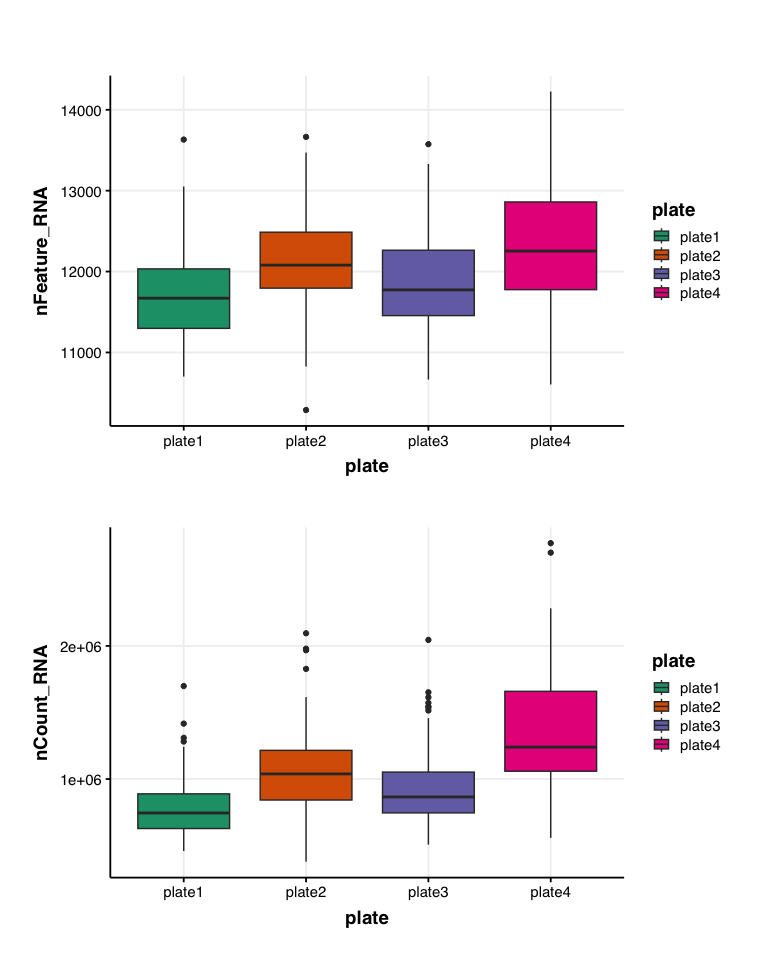
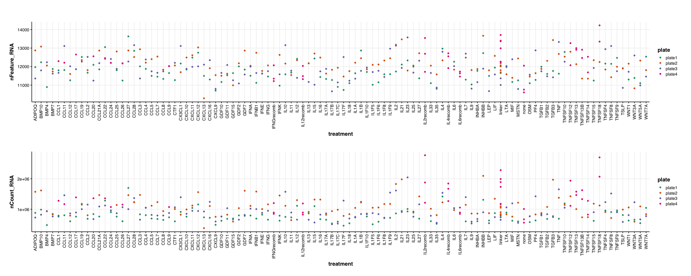
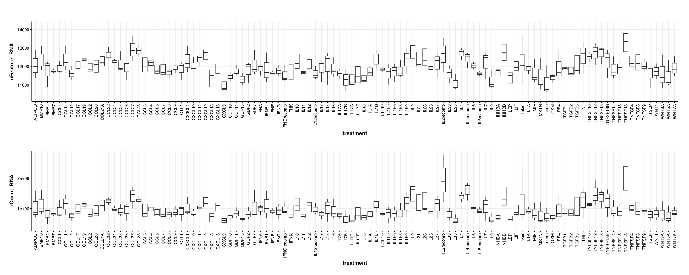
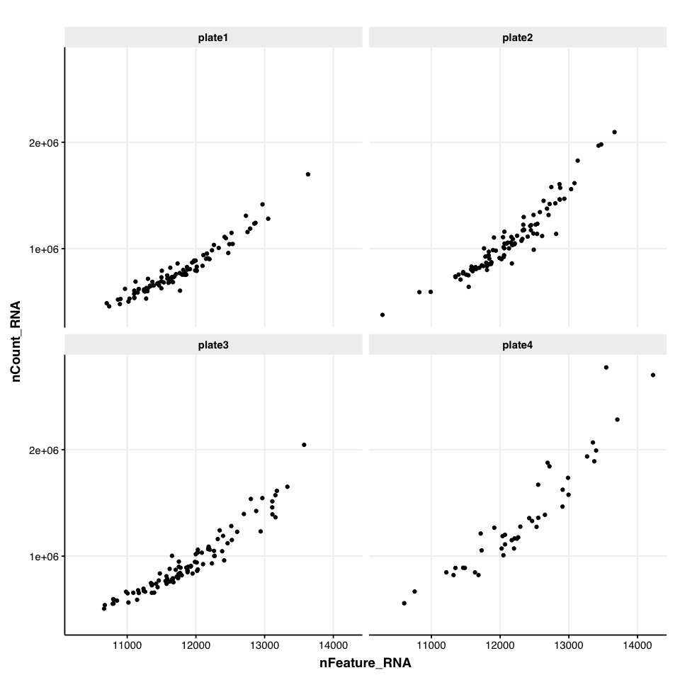

SIG06 RNAseq Processing
================
Eric Y. Wang
2024-11-18

- [<u>Import Data</u>](#import-data)
- [<u>Sample Level QC</u>](#sample-level-qc)
- [<u>Process and export matrix</u>](#process-and-export-matrix)

``` r
library(tidyverse)
```

    ## ── Attaching core tidyverse packages ──────────────────────── tidyverse 2.0.0 ──
    ## ✔ dplyr     1.1.4     ✔ readr     2.1.5
    ## ✔ forcats   1.0.0     ✔ stringr   1.5.1
    ## ✔ ggplot2   3.5.1     ✔ tibble    3.2.1
    ## ✔ lubridate 1.9.3     ✔ tidyr     1.3.1
    ## ✔ purrr     1.0.2     
    ## ── Conflicts ────────────────────────────────────────── tidyverse_conflicts() ──
    ## ✖ dplyr::filter() masks stats::filter()
    ## ✖ dplyr::lag()    masks stats::lag()
    ## ℹ Use the conflicted package (<http://conflicted.r-lib.org/>) to force all conflicts to become errors

``` r
library(ggplot2)
library(cowplot)
```

    ## 
    ## Attaching package: 'cowplot'
    ## 
    ## The following object is masked from 'package:lubridate':
    ## 
    ##     stamp

``` r
library(patchwork)
```

    ## 
    ## Attaching package: 'patchwork'
    ## 
    ## The following object is masked from 'package:cowplot':
    ## 
    ##     align_plots

``` r
library(DESeq2)
```

    ## Loading required package: S4Vectors
    ## Loading required package: stats4
    ## Loading required package: BiocGenerics
    ## 
    ## Attaching package: 'BiocGenerics'
    ## 
    ## The following objects are masked from 'package:lubridate':
    ## 
    ##     intersect, setdiff, union
    ## 
    ## The following objects are masked from 'package:dplyr':
    ## 
    ##     combine, intersect, setdiff, union
    ## 
    ## The following objects are masked from 'package:stats':
    ## 
    ##     IQR, mad, sd, var, xtabs
    ## 
    ## The following objects are masked from 'package:base':
    ## 
    ##     anyDuplicated, aperm, append, as.data.frame, basename, cbind,
    ##     colnames, dirname, do.call, duplicated, eval, evalq, Filter, Find,
    ##     get, grep, grepl, intersect, is.unsorted, lapply, Map, mapply,
    ##     match, mget, order, paste, pmax, pmax.int, pmin, pmin.int,
    ##     Position, rank, rbind, Reduce, rownames, sapply, setdiff, table,
    ##     tapply, union, unique, unsplit, which.max, which.min
    ## 
    ## 
    ## Attaching package: 'S4Vectors'
    ## 
    ## The following objects are masked from 'package:lubridate':
    ## 
    ##     second, second<-
    ## 
    ## The following objects are masked from 'package:dplyr':
    ## 
    ##     first, rename
    ## 
    ## The following object is masked from 'package:tidyr':
    ## 
    ##     expand
    ## 
    ## The following object is masked from 'package:utils':
    ## 
    ##     findMatches
    ## 
    ## The following objects are masked from 'package:base':
    ## 
    ##     expand.grid, I, unname
    ## 
    ## Loading required package: IRanges
    ## 
    ## Attaching package: 'IRanges'
    ## 
    ## The following object is masked from 'package:lubridate':
    ## 
    ##     %within%
    ## 
    ## The following objects are masked from 'package:dplyr':
    ## 
    ##     collapse, desc, slice
    ## 
    ## The following object is masked from 'package:purrr':
    ## 
    ##     reduce
    ## 
    ## Loading required package: GenomicRanges
    ## Loading required package: GenomeInfoDb
    ## Loading required package: SummarizedExperiment
    ## Loading required package: MatrixGenerics
    ## Loading required package: matrixStats
    ## 
    ## Attaching package: 'matrixStats'
    ## 
    ## The following object is masked from 'package:dplyr':
    ## 
    ##     count
    ## 
    ## 
    ## Attaching package: 'MatrixGenerics'
    ## 
    ## The following objects are masked from 'package:matrixStats':
    ## 
    ##     colAlls, colAnyNAs, colAnys, colAvgsPerRowSet, colCollapse,
    ##     colCounts, colCummaxs, colCummins, colCumprods, colCumsums,
    ##     colDiffs, colIQRDiffs, colIQRs, colLogSumExps, colMadDiffs,
    ##     colMads, colMaxs, colMeans2, colMedians, colMins, colOrderStats,
    ##     colProds, colQuantiles, colRanges, colRanks, colSdDiffs, colSds,
    ##     colSums2, colTabulates, colVarDiffs, colVars, colWeightedMads,
    ##     colWeightedMeans, colWeightedMedians, colWeightedSds,
    ##     colWeightedVars, rowAlls, rowAnyNAs, rowAnys, rowAvgsPerColSet,
    ##     rowCollapse, rowCounts, rowCummaxs, rowCummins, rowCumprods,
    ##     rowCumsums, rowDiffs, rowIQRDiffs, rowIQRs, rowLogSumExps,
    ##     rowMadDiffs, rowMads, rowMaxs, rowMeans2, rowMedians, rowMins,
    ##     rowOrderStats, rowProds, rowQuantiles, rowRanges, rowRanks,
    ##     rowSdDiffs, rowSds, rowSums2, rowTabulates, rowVarDiffs, rowVars,
    ##     rowWeightedMads, rowWeightedMeans, rowWeightedMedians,
    ##     rowWeightedSds, rowWeightedVars
    ## 
    ## Loading required package: Biobase
    ## Welcome to Bioconductor
    ## 
    ##     Vignettes contain introductory material; view with
    ##     'browseVignettes()'. To cite Bioconductor, see
    ##     'citation("Biobase")', and for packages 'citation("pkgname")'.
    ## 
    ## 
    ## Attaching package: 'Biobase'
    ## 
    ## The following object is masked from 'package:MatrixGenerics':
    ## 
    ##     rowMedians
    ## 
    ## The following objects are masked from 'package:matrixStats':
    ## 
    ##     anyMissing, rowMedians

``` r
library(Matrix)
```

    ## 
    ## Attaching package: 'Matrix'
    ## 
    ## The following object is masked from 'package:S4Vectors':
    ## 
    ##     expand
    ## 
    ## The following objects are masked from 'package:tidyr':
    ## 
    ##     expand, pack, unpack

``` r
knitr::opts_chunk$set(echo = TRUE)
```

``` r
source("../functions/plotting_fxns.R")
theme_set(theme_Publication())
```

    ## 
    ## Attaching package: 'ggthemes'

    ## The following object is masked from 'package:cowplot':
    ## 
    ##     theme_map

### <u>Import Data</u>

Create counts matrix using *UMI collapsed data*

``` r
matrix_dir <- "../star_output/"

load_matrix <- function(sample){
  # import UMI count matrix
  mat <- readMM(paste0(matrix_dir,sample,"Solo.out/Gene/raw/umiDedup-1MM_Directional.mtx")) %>%
    as.matrix() %>%
    as.data.frame()
  
  # import barcode names
  barcodeNames <- read_tsv(paste0(matrix_dir,sample,"Solo.out/Gene/raw/barcodes.tsv"), col_names = F)
  colnames(barcodeNames) <- "barcode"
  
  # import feature names
  featureNames <- read_tsv(paste0(matrix_dir,sample,"Solo.out/Gene/raw/features.tsv"), col_names = F)
  colnames(featureNames) <- c("ensembl_ID","gene","category")
  
  colnames(mat) <- barcodeNames$barcode
  rownames(mat) <- featureNames$ensembl_ID
  
  return(mat)
}

# import feature names
featureNames <- read_tsv(paste0(matrix_dir,"SIG06_1_Solo.out/Gene/raw/features.tsv"), col_names = F)
```

    ## Rows: 57186 Columns: 3
    ## ── Column specification ────────────────────────────────────────────────────────
    ## Delimiter: "\t"
    ## chr (3): X1, X2, X3
    ## 
    ## ℹ Use `spec()` to retrieve the full column specification for this data.
    ## ℹ Specify the column types or set `show_col_types = FALSE` to quiet this message.

``` r
colnames(featureNames) <- c("ensembl_ID","gene","category")
```

``` r
mat_SIG06_1 <- load_matrix("SIG06_1_")
```

    ## Rows: 96 Columns: 1
    ## ── Column specification ────────────────────────────────────────────────────────
    ## Delimiter: "\t"
    ## chr (1): X1
    ## 
    ## ℹ Use `spec()` to retrieve the full column specification for this data.
    ## ℹ Specify the column types or set `show_col_types = FALSE` to quiet this message.
    ## Rows: 57186 Columns: 3
    ## ── Column specification ────────────────────────────────────────────────────────
    ## Delimiter: "\t"
    ## chr (3): X1, X2, X3
    ## 
    ## ℹ Use `spec()` to retrieve the full column specification for this data.
    ## ℹ Specify the column types or set `show_col_types = FALSE` to quiet this message.

``` r
mat_SIG06_2 <- load_matrix("SIG06_2_")
```

    ## Rows: 96 Columns: 1
    ## ── Column specification ────────────────────────────────────────────────────────
    ## Delimiter: "\t"
    ## chr (1): X1
    ## 
    ## ℹ Use `spec()` to retrieve the full column specification for this data.
    ## ℹ Specify the column types or set `show_col_types = FALSE` to quiet this message.
    ## Rows: 57186 Columns: 3
    ## ── Column specification ────────────────────────────────────────────────────────
    ## Delimiter: "\t"
    ## chr (3): X1, X2, X3
    ## 
    ## ℹ Use `spec()` to retrieve the full column specification for this data.
    ## ℹ Specify the column types or set `show_col_types = FALSE` to quiet this message.

``` r
mat_SIG06_3 <- load_matrix("SIG06_3_")
```

    ## Rows: 96 Columns: 1
    ## ── Column specification ────────────────────────────────────────────────────────
    ## Delimiter: "\t"
    ## chr (1): X1
    ## 
    ## ℹ Use `spec()` to retrieve the full column specification for this data.
    ## ℹ Specify the column types or set `show_col_types = FALSE` to quiet this message.
    ## Rows: 57186 Columns: 3
    ## ── Column specification ────────────────────────────────────────────────────────
    ## Delimiter: "\t"
    ## chr (3): X1, X2, X3
    ## 
    ## ℹ Use `spec()` to retrieve the full column specification for this data.
    ## ℹ Specify the column types or set `show_col_types = FALSE` to quiet this message.

``` r
mat_SIG06_4 <- load_matrix("SIG06_4_")
```

    ## Rows: 96 Columns: 1
    ## ── Column specification ────────────────────────────────────────────────────────
    ## Delimiter: "\t"
    ## chr (1): X1
    ## 
    ## ℹ Use `spec()` to retrieve the full column specification for this data.
    ## ℹ Specify the column types or set `show_col_types = FALSE` to quiet this message.
    ## Rows: 57186 Columns: 3
    ## ── Column specification ────────────────────────────────────────────────────────
    ## Delimiter: "\t"
    ## chr (3): X1, X2, X3
    ## 
    ## ℹ Use `spec()` to retrieve the full column specification for this data.
    ## ℹ Specify the column types or set `show_col_types = FALSE` to quiet this message.

Create metadata assignments

``` r
meta1 <- read_csv("../metadata/lib1_metadata.csv")
```

    ## Rows: 96 Columns: 5
    ## ── Column specification ────────────────────────────────────────────────────────
    ## Delimiter: ","
    ## chr (5): barcode, well, treatment, replicate, plate
    ## 
    ## ℹ Use `spec()` to retrieve the full column specification for this data.
    ## ℹ Specify the column types or set `show_col_types = FALSE` to quiet this message.

``` r
meta2 <- read_csv("../metadata/lib2_metadata.csv")
```

    ## Rows: 96 Columns: 5
    ## ── Column specification ────────────────────────────────────────────────────────
    ## Delimiter: ","
    ## chr (5): barcode, well, treatment, replicate, plate
    ## 
    ## ℹ Use `spec()` to retrieve the full column specification for this data.
    ## ℹ Specify the column types or set `show_col_types = FALSE` to quiet this message.

``` r
meta3 <- read_csv("../metadata/lib3_metadata.csv")
```

    ## Rows: 96 Columns: 5
    ## ── Column specification ────────────────────────────────────────────────────────
    ## Delimiter: ","
    ## chr (5): barcode, well, treatment, replicate, plate
    ## 
    ## ℹ Use `spec()` to retrieve the full column specification for this data.
    ## ℹ Specify the column types or set `show_col_types = FALSE` to quiet this message.

``` r
meta4 <- read_csv("../metadata/lib4_metadata.csv")
```

    ## Rows: 96 Columns: 5
    ## ── Column specification ────────────────────────────────────────────────────────
    ## Delimiter: ","
    ## chr (5): barcode, well, treatment, replicate, plate
    ## 
    ## ℹ Use `spec()` to retrieve the full column specification for this data.
    ## ℹ Specify the column types or set `show_col_types = FALSE` to quiet this message.

``` r
assign_meta <- function(meta, matrix){
  # merge barcode sample assignments with barcode names
  metadata <- left_join(tibble(barcode = colnames(matrix)), meta) %>%
    mutate(sample_ID = paste0(treatment,"_",replicate,"_",plate,"_",well)) %>%
    drop_na()
  
  # filter for assigned barcodes and rename
  matrix <- matrix[,metadata$barcode]
  colnames(matrix) <- metadata$sample_ID
  
  return(matrix)
}
```

``` r
mat1_assigned <- assign_meta(meta1, mat_SIG06_1)
```

    ## Joining with `by = join_by(barcode)`

``` r
mat2_assigned <- assign_meta(meta2, mat_SIG06_2)
```

    ## Joining with `by = join_by(barcode)`

``` r
mat3_assigned <- assign_meta(meta3, mat_SIG06_3)
```

    ## Joining with `by = join_by(barcode)`

``` r
mat4_assigned <- assign_meta(meta4, mat_SIG06_4)
```

    ## Joining with `by = join_by(barcode)`

Check dimensions of matrices

``` r
dim(mat1_assigned)
```

    ## [1] 57186    96

``` r
dim(mat2_assigned)
```

    ## [1] 57186    96

``` r
dim(mat3_assigned)
```

    ## [1] 57186    96

``` r
dim(mat4_assigned)
```

    ## [1] 57186    42

create combined matrix

``` r
mat <- cbind(mat1_assigned,
             mat2_assigned,
             mat3_assigned,
             mat4_assigned)
```

### <u>Sample Level QC</u>

``` r
sampleQC <- tibble(sample_ID = colnames(mat),
                   sample_ID2 = colnames(mat),
                   nFeature_RNA = colSums(mat > 0),
                   nCount_RNA = colSums(mat)) %>%
  separate(sample_ID2, into = c("treatment", "replicate", "plate","well"), sep = "_")
```

``` r
p1 <- ggplot(sampleQC, aes(x = plate, y = nFeature_RNA, fill = plate)) +
  geom_boxplot() +
  scale_fill_brewer(palette = "Dark2")

p2 <- ggplot(sampleQC, aes(x = plate, y = nCount_RNA, fill = plate)) +
  geom_boxplot() +
  scale_fill_brewer(palette = "Dark2")

p1/p2
```

<!-- -->

``` r
p1 <- ggplot(sampleQC, aes(x = treatment, y = nFeature_RNA, color = plate)) +
  geom_point() +
  scale_color_brewer(palette = "Dark2") +
  theme(axis.text.x = element_text(angle = 90, vjust=0.5, hjust = 1))


p2 <- ggplot(sampleQC, aes(x = treatment, y = nCount_RNA, color = plate)) +
  geom_point() +
  scale_color_brewer(palette = "Dark2") +
  theme(axis.text.x = element_text(angle = 90, vjust=0.5, hjust = 1))

p1/p2
```

<!-- -->

``` r
p1 <- ggplot(sampleQC, aes(x = treatment, y = nFeature_RNA)) +
  geom_boxplot() +
  theme(axis.text.x = element_text(angle = 90, vjust=0.5, hjust = 1))


p2 <- ggplot(sampleQC, aes(x = treatment, y = nCount_RNA)) +
  geom_boxplot() +
  theme(axis.text.x = element_text(angle = 90, vjust=0.5, hjust = 1))

p1/p2
```

<!-- -->

``` r
ggplot(sampleQC, aes(x = nFeature_RNA, y = nCount_RNA)) +
  geom_point() +
  facet_wrap(~plate)
```

<!-- -->

### <u>Process and export matrix</u>

``` r
paste0(sum(rowSums(mat > 0) > 0)," genes have counts > 0 in at least one sample")
```

    ## [1] "36457 genes have counts > 0 in at least one sample"

``` r
paste0(sum(rowSums(mat > 0) == ncol(mat))," genes have counts > 0 in all samples")
```

    ## [1] "6522 genes have counts > 0 in all samples"

``` r
# remove genes that are not expressed in any sample
mat <- mat[rowSums(mat > 0) > 0,]

write.csv(mat, "../processing_outs/count_matrix_umiDeDup_SIG06.csv", row.names = T)
write_csv(sampleQC,"../processing_outs/processed_metadata_SIG06.csv")
write_csv(featureNames,"../processing_outs/featureNames_SIG06.csv")
```
